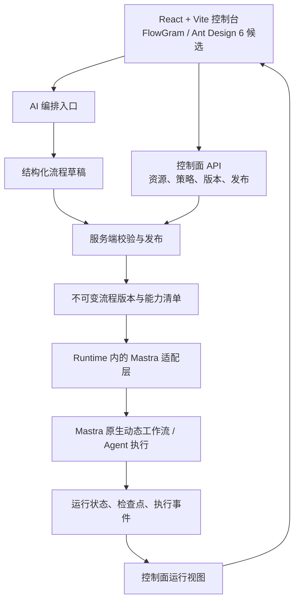

# Mastra 企业 Agent 平台：架构讨论草案

日期：2026-09-07。状态：待讨论；本文记录用户已明确的方向、架构建议与待决问题，不是已批准的规格或已验证的实现。

## 已明确的方向

- 基于 Mastra 建设企业级 Agent 平台。
- 用户已确认 FlowGram 作为流程编排与编辑核心，Mastra 作为主要执行基础。
- 控制面与 Runtime 分离。
- 集中控制面管理平台托管 Runtime，以及多个客户私有网络中的 Runtime。
- 客户 Runtime 主要通过 Docker 交付，同时支持 Linux 直接安装；具体方案见[部署方式](runtime-deployment-profiles.md)。
- 平台自身可存储文档、对话、知识库、Skill 包、工具结果与运行产物，也支持用户在平台内直接调用工具操作业务系统。
- 客户私有部署中的业务内容默认保留在客户私网；客户可按类别与范围授权指定内容上报。这项政策不限制平台托管场景自身的业务数据存储。
- 首期支持同一项目混合使用平台托管与客户私有资源：项目环境设置默认位置，知识库和工具可指定其他位置。
- 对获准内容，客户按模型服务和内容类别配置可处理范围，支持客户自有或明确许可的外部模型。
- 首期提供客户侧主动连接能力，按需部署轻量连接器或完整 Runtime，承接平台到私网的获准调用。
- 平台运营默认仅查看运行状态；查看客户业务正文需要客户授予内容访问权限，托管内容同样适用。
- 支持动态工作流，AI 自动编排是核心能力。
- 首期支持 AI 生成、修改完整流程，发布后按版本执行；Agent 节点可自主选择工具。
- 面向业务团队快速接入 AI，管理 Agent、Skills、工具、知识库等能力。
- 保留独立 Agent 使用路径与知识库能力，工作流继续作为可组合的编排能力。
- Skills 采用标准 Agent Skills 格式，支持压缩包上传并校验规范；包内脚本按版本和资源范围授权后，在选定 Runtime 的隔离环境中自主执行。
- Skill 脚本环境按用户授权继续采用 Node.js、Python、Bash 基线，依赖提前准备并固定。
- 工作流同时用于业务任务和知识库文档处理。
- 提供公开 API、OpenAPI 契约和自动生成的 SDK，也支持在平台内使用。
- 允许第三方业务系统注册工具和 MCP 服务。
- 业务应用接入支持统一认证以及 AK/SK、AppID 应用验证两类方式；平台可承担统一认证中心角色，也可接入第三方统一认证中心。
- 提供可嵌入业务系统的 UI 组件库，支持 UI SDK 和 iframe 两种接入形式。
- SDK 调用层不手写，Hey API 是代码生成候选。
- 前端使用 React 与 Vite。
- 流程编辑器采用 FlowGram.ai；Chat UI 采用 assistant-ui 的无样式 primitives 与聊天状态管理；Ant Design 6 是管理界面组件库候选。
- 与用户的交流和项目讨论文档使用中文。

当前目录最初为空，尚无 Git 仓库、应用代码、依赖锁文件或既有领域文档。

## 推进路线

按 ask-matt 路由，当前工作适合先形成 Wayfinder 决策地图，再进入 to-spec → to-tickets → implement。遇到需要运行结果才能判断的问题，安排范围明确的 prototype。

用户已启动 wayfinder，当前的决策入口为[企业 Agent 平台首期架构决策地图](../../.scratch/agent-platform/map.md)。按无远端 tracker 时的默认规则，决策票据暂存本地 Markdown；仓库级工程技能配置仍未初始化。Skill 契约、平台托管与私有数据边界、身份关系、通用合成验收样例与容量先实测已确定。Skill 的 Mastra 适配和 Docker 基础隔离已有首轮运行证据；许可联网、撤销恢复、身份协议、完整编排与接入仍待验证。

## 建议的职责边界

| 部分 | 建议职责 | 要明确的边界 |
| --- | --- | --- |
| React + Vite 控制台 | 管理资源、通过对话生成流程、展示与编辑画布、调试及查看运行记录 | AI 与手工编辑共同操作同一份流程定义 |
| 控制面 | 身份与项目、Agent/工具/模型目录、定义版本、发布、运行准入、策略和审计查询 | 管理配置与发布；执行能力通过独立的 Runtime 获得 |
| 定义与校验层 | 平台版本与策略元数据、执行定义、节点能力目录、变量类型及资源限制校验 | 优先复用 Mastra 原生动态定义的执行语义；画布布局单独保存；是否扩展定义由原型结果决定 |
| Mastra 适配层 | 将 FlowGram 编辑结果映射为 Mastra 动态定义，注册依赖并加载已发布版本 | 对每个节点和控制结构明确语义映射，遇到不支持的图结构应明确拒绝 |
| Runtime | 执行已绑定版本的流程、Agent 与工具调用，保存检查点，挂起/恢复，产生事件 | 对执行状态负责，具备独立的发布、伸缩和故障恢复边界 |
| 业务数据存储 | 保存文档、知识库、对话、Skill 包、工具结果与运行产物 | 支持平台托管或客户私有存储；按资源归属、授权和驻留政策读写 |

AI 编排入口是产品能力的归属；生成和试运行所需的模型、工具计算可以作为 Runtime 任务执行。Runtime 可以由平台托管或部署在客户私有环境；运行视图只获取调用者有权查看且允许传输的内容。这个图没有决定具体网络拓扑和传输协议。

用户已确认 FlowGram 负责流程编排与编辑，Mastra 负责执行。当前执行内核方向是 Mastra 原生动态工作流，每次运行由 Mastra 一侧负责控制流、重试和检查点。决策见 [ADR：FlowGram 编排、Mastra 执行](../adr/0001-flowgram-authoring-mastra-execution.md)，选型背景见[FlowGram 与 React Flow 比较](flowgram-vs-react-flow.md)。选型成立不代表定义映射与故障恢复已经通过验证。

## 把动态工作流拆成三个可验收能力

| 能力 | 用户体验 | 建议的执行与版本语义 |
| --- | --- | --- |
| 设计时生成与修改 | 用户描述任务，AI 生成节点、连接、参数与变量；继续对话可修改现有流程 | AI 输出受 Schema 约束的定义或补丁；经过同一套服务端校验后形成可发布版本 |
| 节点内自主执行 | 一个 Agent 节点根据上下文自主选择工具、模型或子 Agent | 外层工作流版本固定；节点内部受工具授权、预算、迭代次数和超时限制 |
| 运行时重新规划 | 执行过程中根据结果增加、替换或调整后续任务 | 需要计划修订记录、检查点、已完成动作去重和必要的再审批；作为独立待决能力 |

用户已选择首期支持前两项。第三项留作后续能力，不纳入已确认的首期范围。

AI 编排的候选闭环：意图与上下文 → 授权范围内的能力检索 → 生成定义/补丁 → 结构、类型、图和策略校验 → 有界修复 → 试运行与评估 → 按发布策略生效。画布同步呈现这份定义。发布是否人工批准、哪些动作触发审批，取决于实际业务，尚未确定。

定义层至少应考虑：schemaVersion、节点类型及其版本、输入输出与变量绑定、显式控制结构、工具和模型配置引用、失败/重试策略。发布版本应固定所依赖的节点与适配器兼容版本。凭据通过受权限约束的引用解析。

## 控制面与 Runtime 分离的验收问题

这些问题需要在后续决策中给出明确答案：

1. 控制面短暂不可用时，已接收的任务允许继续到哪个边界？新任务、审批、策略撤销如何处理？
2. 谁是运行状态的权威来源？建议 Runtime 保存检查点与事件，控制面维护查询投影；是否独立数据库需进一步决定。
3. Runtime 是否需要主动从私有网络连接控制面？定义和命令如何签收、去重、排序及重传？
4. 如何保证一次运行持续绑定同一个工作流版本？升级期间旧版本如何保留、恢复和回滚？
5. 多 worker 如何领取任务、续租和接管？租约过期后如何阻止旧 worker 继续提交状态或产生副作用？
6. 写入外部系统的工具是否支持稳定业务幂等键？当外部系统不支持时，如何对账和人工处理不确定结果？
7. 租户隔离需要覆盖数据、运行进程、网络、Secret 和配额中的哪些层次？是否允许用户代码？

仅拆开两个服务进程不足以回答这些问题。恢复 API、持久化存储与分布式执行一致性需要分别验证。

## 技术候选与当前证据

- Mastra 已提供原生 JSON 动态工作流，由 LLM 或可视化编辑器生成定义后可通过 `addDynamicWorkflow()` 注册；存储适配器支持 `workflowDefinitions` 时可持久化。该能力目前标为 beta。官方称同 ID 更新只影响新运行；跨重启、依赖升级时旧版本的恢复仍需验证：[Dynamic workflows](https://mastra.ai/docs/workflows/dynamic-workflows)。
- Mastra 工作流还提供显式组合、运行状态、流式结果与恢复接口。FlowGram 到原生动态定义的映射、支持的控制结构和部署隔离需要实际验证：[Workflows overview](https://mastra.ai/docs/workflows/overview)。
- FlowGram 包含画布、表单、变量、物料及后端 runtime。后端能力和与 Mastra 的关系详见[独立研究笔记](../research/mastra-flowgram-boundaries-2026-09-07.md)；目前不把任何直接适配当作已确认能力：[FlowGram](https://flowgram.ai/)。
- Ant Design 6 官方要求 React >= 18，直接兼容 React 19，图标包需要 >= 6，默认使用 CSS 变量并面向现代浏览器。具体 React、FlowGram、Vite 与组件包版本组合在原型阶段锁定验证：[v6 迁移说明](https://ant.design/docs/react/migration-v6/)。
- 用户已确认 Chat UI 采用 assistant-ui：基于无样式 primitives 封装平台聊天组件，并优先使用官方 Mastra/AI SDK 集成。边界见 [ADR](../adr/0002-assistant-ui-chat-foundation.md)，比较依据见[调研报告](../research/chat-ui-selection-2026-09-07.md)。

本文没有锁定 Mastra、FlowGram 或 Ant Design 的具体补丁版本，也没有执行兼容性或生产验证。

## 首轮已确认

1. 集中控制面管理多个客户私有网络中的 Runtime；后续用户澄清，平台也要提供自身的运行、存储与直接业务操作能力。
2. AI 生成/修改流程并发布固定版本，节点内部可自主选工具。
3. 用户补充平台的能力管理与接入目标，覆盖知识库文档处理、第三方工具/MCP 注册、生成 SDK、UI SDK 和 iframe；尚未指定单一业务验收用例。

## 使用入口与运行、存储位置

平台内使用和业务系统接入是两种使用入口，均可使用平台托管或客户私有的能力。嵌入 UI 不要求业务系统自建 Runtime，平台内使用也不要求业务数据统一存入集中环境。

| 使用入口 | 平台托管运行与存储 | 客户私有运行与存储 |
| --- | --- | --- |
| 平台内使用 | 用户聊天、上传文档、管理知识库；平台 Runtime 调用授权工具，平台保存历史与产物 | 用户通过获准的网络路径访问客户 Runtime 与内容；展示和传输受客户政策约束 |
| 业务系统嵌入或 API 调用 | SDK、UI 组件或 iframe 使用平台服务，业务系统无需另建 Runtime | SDK、UI 组件或 iframe 连接客户 Runtime，业务内容保存在客户指定环境 |

平台整体包含控制面、平台托管 Runtime 和业务数据存储。控制面与 Runtime 分离约束的是内部职责、生命周期和故障边界，不排除它们由同一个平台提供。

用户已确认项目环境设置默认位置，知识库和工具可指定其他位置。因此同一项目可以由平台保存会话并运行 Agent，同时使用客户私有知识库和工具。对获准返回的内容，客户按模型服务与内容类别配置处理范围，可使用自有或明确许可的外部模型。运行和数据目的地建议由服务端根据资源归属及授权绑定选择，不能仅由界面来源或模型决定。[数据与网络决策](../../.scratch/agent-platform/issues/01-data-and-network-boundary.md)已收敛主动连接与运营访问等产品方向，具体策略、网络证据和位置变更行为由[资源放置与运行路由方案](data-placement-routing-proposal.md)所列后续任务承接。

## 接入与业务系统网络：架构建议

平台托管 Runtime 可调用网络可达且已授权的业务 API 或 MCP 服务。业务接口仅在客户私网可达时，由客户侧主动连接能力承接获准请求：客户按需安装轻量连接器或完整 Runtime。该交付方向已确认；具体连接协议、凭据位置和内容规则仍需设计验证，见[部署方案](runtime-deployment-profiles.md)。业务操作继续适用工具授权、业务动作审批与审计。

对于客户私有部署，建议客户 Runtime 主动建立管理连接、获取发布版本并同步获准上报的管理事件，避免默认要求客户私网允许控制面直接入站。使用私有资源的客户业务应用优先通过本地 Runtime Gateway 执行业务调用；调用入口与数据驻留策略必须一致。

Runtime Gateway 是建议的逻辑边界，是否独立进程尚未决定。集中控制台的调试/聊天、iframe 的部署来源及浏览器能否到达私网，需要明确网络路径。如果业务内容不得经过集中控制面，就需要客户侧 UI/网关或可达私网的浏览器连接方案；不能仅靠控制面页面承诺私网直连已经解决。

公开 API 建议按调用者分为管理 API 与执行 API，并对外维护稳定的平台契约。Mastra 接口作为执行适配的内部依赖，平台负责客户/项目、授权、发布版本与运行事件的统一语义。

| 接入形式 | 建议职责 | 契约与复用 |
| --- | --- | --- |
| API SDK | 创建运行、获取状态、发送消息、上传文档、注册工具等调用 | 从 OpenAPI 自动生成请求方法、类型和模型；管理 SDK 与执行 SDK 按权限边界分包 |
| UI SDK | 基于 assistant-ui 的聊天、引用、运行进度、附件与人工交互等可嵌入组件 | 复用生成 SDK 与统一聊天状态；按 React 组件和 iframe 交付，具体宿主支持矩阵待确认 |
| iframe | 通过嵌入式页面接入上述交互能力 | 复用同一 UI 组件和执行 API；明确宿主 origin、主题、语言、尺寸与受限会话握手 |
| 平台内使用 | 调试与实际使用已发布 Agent/工作流，管理知识库并通过工具操作业务系统 | 复用同一执行接口与授权逻辑，可使用平台托管或客户私有资源 |

业务应用的认证入口已确定为统一认证与 AK/SK、AppID 两类。平台本身还需具备统一认证中心能力，并支持外部身份接入；具体交付方案见[身份中心方案](identity-center-delivery-proposal.md)。两类入口复用平台资源授权与审计语义；应用自身任务和可信用户委托的产品边界已在[身份与授权决策](../../.scratch/agent-platform/issues/02-tenancy-and-delegation.md)关闭，接入证明、凭据生命周期及撤销仍需协议验证。

组织层级、应用自身任务、用户委托及会话归属见[身份授权方案](identity-authorization-proposal.md)。当前采用客户租户、多项目及目标环境，资源默认项目私有并可显式跨项目授权，会话默认按应用入口隔离，客户管理与正文权限分开；角色配置与协议实现继续细化。

AppID 是应用标识；建议由应用后端持有 SK 完成认证，浏览器接入使用短时、限定应用/用户/资源范围的会话凭据。React UI SDK 和 iframe 中不分发长期 SK。这是接入方案建议，具体签名或令牌交换协议仍需确定。浏览器无法可靠保守客户端机密的边界参见 [OAuth 客户端类型](https://www.rfc-editor.org/rfc/rfc6749.html#section-2.1)。

统一认证协议可优先评估 OIDC；它在 OAuth 2.0 之上表达用户认证身份。本段不是协议选型决定，也没有将 AK/SK 与 OAuth client secret 的语义直接等同。[OIDC Core](https://openid.net/specs/openid-connect-core-1_0.html)。UI SDK 中需实现交互和状态组合，但 HTTP 请求方法应继续从契约生成；生成目录不手改。

Hey API 官方支持从 OpenAPI 生成 TypeScript，并提供 SDK、类型、客户端等插件；官方要求锁定生成器具体版本。其他语言 SDK 仍可基于同一 OpenAPI 选择对应生成器，不能默认 Hey API 覆盖所有语言。流式事件类型、认证续期、断线续传、取消和文件上传需要纳入生成产物的实际验收。[开始使用](https://heyapi.dev/docs/openapi/typescript/get-started)、[SDK 插件](https://heyapi.dev/docs/openapi/typescript/plugins/sdk)。

## 能力管理与知识库：架构建议

- 控制面维护 Agent、Skill、工具、MCP 服务与知识库的目录、版本和授权关系；平台提供业务内容存储能力，也支持客户私有存储。资源的数据和凭据位置按其运行、存储绑定与驻留政策确定。
- 第三方注册工具或 MCP 服务时，记录作用范围、输入输出、调用位置和凭据引用。位于客户私网的接口发现、可用性验证和调用建议交给该客户 Runtime；注册目录不自动代表允许所有 Agent 调用。
- 区分 Skill、工具和工作流：Skill 已确定采用标准 Agent Skills 包并支持压缩上传；工具是可调用操作；工作流是已编排的执行定义。格式校验和脚本授权分别处理，具体要求见[Skill 决策](../../.scratch/agent-platform/issues/03-skill-contract.md)。
- Skill 的包与授权产品契约已收敛，技术承接见[运行架构基线](skill-runtime-architecture.md)。Mastra 版本化内容读取可优先复用，模型侧脚本入口和选定运行环境中的权限执行需由平台落实；具体沙箱与部署条件仍待原型验证。
- 知识库文档处理使用同一工作流机制，候选链路为上传/采集 → 解析/OCR → 清洗 → 切分 → 元数据与权限处理 → 向量化/索引 → 发布可检索版本。各步骤按实际文档格式选择，不默认每份文档都经过 OCR。
- 文档处理需记录原始文档版本、处理流程版本与索引版本；重试、更新和删除应保持引用及权限一致。知识库是平台领域能力，不能只包装向量数据库接口。

用户已采用通用合成验收闭环：登记并授权业务工具 → AI 生成文档入库流程 → 发布并处理文档 → Agent 基于知识库和工具完成订单查询与报表 → 平台内使用，并通过生成 SDK、React 组件与 iframe 复用。独立 Agent、独立知识库与工作流分别验证，同时覆盖平台托管、客户私有和混合位置。容量先实测，之后补客户目标；详细检查见[首期验收方案](first-release-acceptance-proposal.md)。

## 当前仍待收敛

1. 数据与接入产品方向已确认；精确内容策略、管理字段与保留/删除由[内容策略决策](../../.scratch/agent-platform/issues/20-content-policy-lifecycle.md)细化，网络行为由[主动连接原型](../../.scratch/agent-platform/issues/21-private-connection-prototype.md)验证，撤销时效由运行恢复契约定义。
2. 脚本执行、语言与提前固定依赖的基线已确定；默认资源规则、具体沙箱和压缩包导入细则仍需落实。
3. 身份与资源授权的产品基线已收敛，具体身份来源映射、凭据交换、帐号生命周期和统一身份中心交付仍需细化并验证。
4. 首期已采用通用合成样例与容量先实测，完整链路、客户环境及正式容量目标仍待验证或补齐。

## 后续需细化

- 已确定身份关系之上的权限操作、身份集成协议和发布流程。
- 长任务持续时间、人工挂起周期、并发、可用性与恢复目标。
- 工具目录与 MCP、知识库、模型接入、用量、评估与可观测性的具体首期验收边界。
- 受限图模型能否满足实际业务，以及 FlowGram 的结构化/自由画布选择。
- 按已确定合成闭环取得完整运行与接入证据。

建议优先验证的技术问题是：同一份 AI 生成定义可编辑并运行、旧版本任务跨 Runtime 重启恢复、重复投递或接管时外部动作的幂等性。技术原型的通过不能替代真实业务与目标部署环境的验收。
