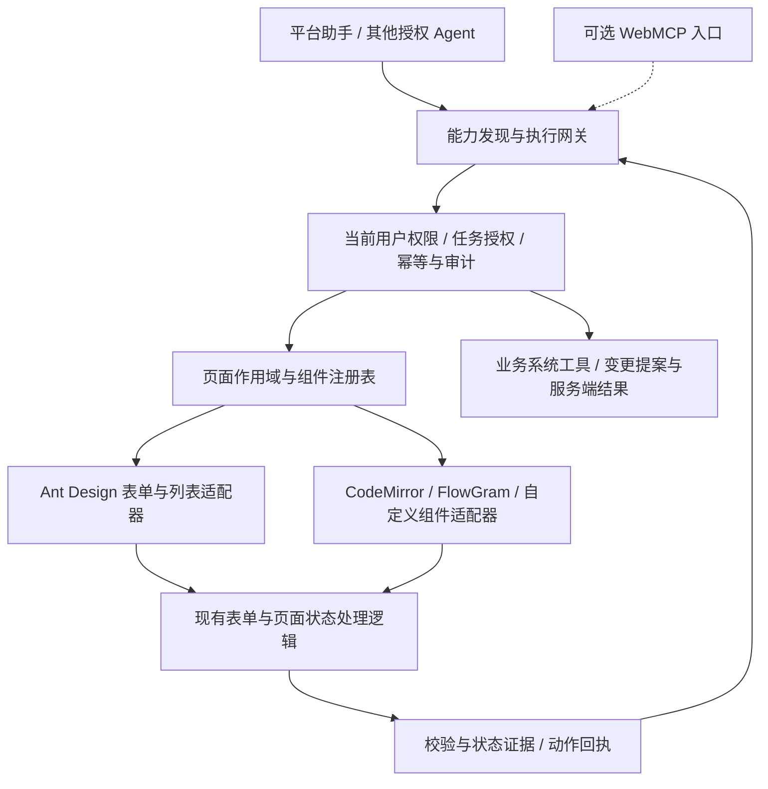

# Agent 应用交互规范与组件适配草案

> 2026-09-14：第一阶段已实现并通过本地真实模型与浏览器验收。实际交付范围、API 和接入方式以 [SDK 接入指南](../development/agent-application-sdk.md) 为准；本草案中业务写入审批、WebMCP 和浏览器扩展等仍属后续阶段。

状态：调研与设计提案，尚未替换现有实现。调研日期：2026-09-14。

顶层规范面向应用，必须允许第三方应用在不采用我们的前端框架或组件库的情况下接入。应用发布业务动作、页面上下文与执行回执；Ant Design、编辑器与画布适配器是平台内部的实现方式。复用现有 Mastra → 控制面 → 浏览器执行回执链，WebMCP 作为可选标准映射，浏览器自动化用于未接入应用和验收。

第三方接入的上层契约见 [Agent 应用接入规范](./agent-application-integration-2026-09-14.md)。本文件保留原路径，组件矩阵与适配器设计作为该契约的内部实现章节。对外身份使用 appId、connectionId、pageSessionId，不暴露平台特有的 projectId、React 实例或 Ant Design 控件类型作为接入前提。

每类组件实现一次通用适配，页面补充业务名称、作用域、字段约束和操作策略。组件实例按需发现，不把整个应用里的每个按钮都作为独立模型工具常驻。

## 1. 当前实现与主要缺口

本轮重新读取了工作区，当前 HEAD 为 `6a2ff15`，已有大量未提交实现；以下结论对应当前工作区，不能视为该 commit 已包含的功能。

- `packages/contracts/src/assistant-ui.ts`：10 个固定 target ID，只支持 click/fill/select，value 为字符串，每次最多 20 个目标及每个目标 20 个选项。
- `apps/console/src/shared/PageActions.tsx`：已有注册/卸载、revision、ready、执行后检查。全页面 revision 随目标值变化，不能表达字段级冲突、弹窗作用域、异步选项游标和批量操作。
- `apps/control-plane/src/modules/assistant/ui.ts`：已有用户权限、会话租约、单次领取及回执；授权目前按页面与 target 前缀分支，扩展到全组件时应改为共享能力目录与服务端策略。
- AgentEditor、Skills/Tools、能力目录通过手写 hook 接入；缺少组件适配层与组件接入验收标准。
- `WorkflowCanvasHandle` 已有 capture/replace/fit/autoLayout/undo/redo/zoom/focus 等语义接口；应优先复用，不必把画布操作全部转换成坐标拖拽。

使用 Ant Design CLI 扫描 154 个源文件，共发现 35 种导入。高频交互组件包括 Button 50、Input 25、Form 19、Select 15、Drawer 13、Tabs 13、Modal 12、Table 12、Switch 4。数字是导入次数，不是可操作实例数或覆盖率。另有 CodeMirror、FlowGram 和自定义轨迹时间轴。

扫描与 API 核对记录在 `.scratch/agent-ui-component-usage.json`、`.scratch/agent-ui-{form,table,select}-api.json`。

## 2. 候选方案与选择

事实来自下列官方资料；适用性与取舍是结合本项目的判断，没有进行这些框架之间的性能排名。

| 方案 | 已核实的能力 | 对本平台的判断 |
| --- | --- | --- |
| 组件适配器 + 现有平台执行链 | 当前已具备注册、租约、动作和回执基础 | 推荐作为主路径；保留现有会话、权限和轨迹，不新增第二套运行时 |
| Tambo Interactable Components | 包装已有 React 组件，按 schema 暴露 props 并自动注册更新工具 | 最接近“组件可被 Agent 操作”的接入体验；借鉴其包装模式，仍需补业务动作、校验及持久化证据。[官方说明](https://docs.tambo.co/concepts/generative-interfaces/interactable-components) |
| CopilotKit + AG-UI | 前端 handler、组件生命周期、动态工具和调用结果回传 | 借鉴前端工具定义与事件语义。替换聊天和 Agent 接入层并不能自动完成全组件适配，当前先保留适配口。[前端工具](https://docs.copilotkit.ai/reference/hooks/useFrontendTool)、[AG-UI 工具](https://docs.ag-ui.com/concepts/tools) |
| WebMCP | 网页注册结构化工具，包含命令式 JavaScript 和声明式表单两种入口 | 值得预留，作为同一能力目录的另一个出口；不作为当前浏览器唯一执行通道。[Chrome 文档](https://developer.chrome.com/docs/ai/webmcp) |
| Playwright MCP | 基于可访问性快照操作页面，扩展可连接现有 Chrome/Edge 页面 | 适合不掌握源码的页面、端到端验收及可访问性回退；连接用户当前浏览器需要额外桥接。[官方仓库](https://github.com/microsoft/playwright-mcp) |
| Stagehand | observe/act/extract，用自然语言发现与执行页面动作 | 外部网站或语义未知的页面再考虑；自己的字段与业务动作已可确定，不必每次让模型推断定位。[observe](https://docs.stagehand.dev/v3/basics/observe)、[act](https://docs.stagehand.dev/v3/basics/act) |
| A2UI | Agent 发送声明式组件描述，由客户端渲染交互界面 | 适合未来任务台生成临时表单、卡片和图表；本轮目标是操作已有界面，A2UI 不能直接补齐这一层。[官方概念](https://a2ui.org/concepts/overview/) |

WebMCP 的时效性需要明确：Chrome 官方文档当前提供 Chrome 149 起的 origin trial；2026-09-10 的规范仍是 Community Group Draft，未成为 W3C 标准。2026-09-11 的命令式文档使用 `document.modelContext`，注册、取消与执行签名仍在演进。不能按旧示例硬编码浏览器 API 或宣称已普遍可用。[试用公告](https://developer.chrome.com/blog/ai-webmcp-origin-trial)、[草案状态](https://webmachinelearning.github.io/webmcp/)、[命令式 API](https://developer.chrome.com/docs/ai/webmcp/imperative-api)

Ant Design 复杂表单往往包含受控 Select、Form.List、异步校验与独立编辑器；应先通过 JavaScript 适配器接入统一能力，声明式 HTML 表单出口留给简单表单。是否启用原生 WebMCP，需要另做实际浏览器兼容验收；本轮没有修改浏览器 flag、安装扩展或接入第三方 Agent。

## 3. 三层职责



1. **应用契约层**：应用声明页面、业务对象、业务动作、输入输出与完成证据；第三方无需暴露组件树或绑定平台技术栈。
2. **实现适配层**：应用自行实现 handler，或者使用组件适配器完成读取、选择、填写、定位和校验。不能从 Button 类型、颜色或文案推断权限。
3. **执行层**：发现、校验、调度、取消、回执、进度和审计。模型只选择已注册动作，所有入口执行同一策略。

有明确业务接口的创建/保存/发布动作优先调用既有系统操作；前端负责展示草稿、校验和定位结果。用户明确要求演示页面过程时，再展示相应交互。不能用模拟点击规避同一业务操作原有的权限或审阅要求。

## 4. 能力定义与实例状态

### 4.1 开发者定义的能力

能力目录由代码中的可信声明生成，与前后端一同版本化。每个动作至少定义：

| 字段 | 含义 |
| --- | --- |
| `definitionId`、`version` | 例如 `form.patch` / `1`，能力类型的稳定身份 |
| `title`、`description` | 用户及 Agent 能理解的目的与使用条件 |
| `inputSchema`、`outputSchema` | JSON Schema；明确数值、布尔、多选数组、日期范围及结构化字段 |
| `effect` | read / view / draft / domain；依据真实副作用，自动保存字段属于 domain |
| `policyKey` | 服务端可信策略引用；浏览器声明不能扩大权限 |
| `retryPolicy` | read-safe / set-with-revision / reconcile-only；不能把 toggle 当幂等 set |
| `completion` | view-committed / validation-settled / server-confirmed |
| `dataPolicy` | 允许提供给模型的字段与脱敏规则 |

参数 schema 是同源定义，不能由模型或网页正文动态改写。模型可见 schema 根节点保持 object，并通过当前供应商的工具 schema 兼容性测试；内部仍作严格分支校验。

### 4.2 页面登记的实例

每个实例至少包含：

- `definitionId`、`instanceId`、`scopeId`、`parentId`：区分主页面、抽屉、弹窗与同名字段。
- `targetRef`、`mountEpoch`：由当前会话注册表解析的临时引用；卸载后旧引用失效，不能重用到新实例。
- `label`、`semanticType`、允许读取的简要状态。
- `availability`：ready / loading / disabled / readonly / hidden / blocked，并给出原因。
- `schemaRevision`、`valueRevision`：约束或选项变化与字段值变化分别表示。
- `actions`：当前可执行能力的简要目录，详细 schema 按需读取。
- `reveal` 关联的元素引用：供本地高亮/滚动定位，不把 DOM 引用序列化给模型。

`targetRef` 不是权限凭证。服务端把它与当前用户、项目、会话、客户端租约、能力目录版本及资源作用域一起校验；前端登记的 policy、effect 或 schema 不能覆盖可信目录。

作用域应声明 `active`，不能仅以 React 是否 mount 判定可用。被 Modal 遮挡、被 Tabs 保留但隐藏的组件不可直接操作；先调用父作用域的打开或切换动作。滚动区域内未处于视口的正常字段可由适配器定位后操作。跨域 iframe 需要明确独立桥接，不自动穿透。

### 4.3 模型发现与上下文控制

保留 `platform_ui` 作为统一入口，下一版本扩展 inspect / describe / act / result：

- inspect：返回当前页面、活动作用域、状态摘要和分页目标目录。
- describe：读取选中目标的字段约束、动作 schema、可用选项及分页游标。
- act：对已发现的目标执行一个明确动作；navigation 作为页面级能力纳入。
- result：查询先前 actionId 的持久化结果；沿用现有运行时自动等待机制。

每次只加载与任务相关的少量能力。表格行、下拉选项与原文按需分页；返回 `loadedCount`、`total`（未知时 null）、`hasMore`，不能将可见切片说成全部数据。保留必要的业务组合动作，例如一次提交“填入六个草稿字段并校验”，减少逐控件模型往返。

注册表按 ID 建索引；批量更新合并发布状态变更，只传必要增量。协议新旧版本必须显式协商，升级失败时维持旧的有限动作或显示不兼容，不静默接受未知动作。

## 5. 执行请求、回执和冲突处理

以下是拟定的调用示意，字段与 hook 名称尚未实现：

```json
{
  "operation": "act",
  "requestId": "request-uuid",
  "targetRef": "active-form-ref",
  "action": "form.patch",
  "expectedRevision": "draft-revision",
  "args": {
    "fields": {
      "name": "企业制度助手",
      "description": "根据制度原文回答并提供出处"
    },
    "validate": true
  }
}
```

用户/项目/会话/运行身份由可信调用上下文注入，不能取自模型 args。

动作生命周期：accepted → executing → succeeded / failed / cancelled / unknown；需要既有审阅的 domain 动作返回 requires-user-action 与 proposalId。状态描述的是本次动作，不等于整个任务完成。

回执至少包含 actionId、requestId、目标与能力版本、开始/结束时间、执行前后 revision、实际效果、错误、可恢复性和证据：

```json
{
  "actionId": "action-uuid",
  "status": "succeeded",
  "effect": "draft",
  "changedFields": ["name", "description"],
  "validation": { "status": "passed", "errors": [] },
  "persistence": { "status": "not-requested" },
  "afterRevision": "next-draft-revision",
  "message": "已填入并通过校验，尚未保存"
}
```

必须满足以下条件：

1. 完整接收并校验参数后再执行，禁止部分流式参数触发业务写入。
2. 执行前再次核对实例、权限、可用状态与预期 revision。同一活动页面的修改串行执行；只读操作可并行。子代理也不能同时争用页面写入口。
3. 人工修改与 Agent 修改共享同一状态源。发现用户修改目标字段时停止并返回冲突，不自动覆盖；无关控件变化不应导致全页面动作全部失败。
4. Form.patch 先校验允许字段与参数类型，再按声明顺序应用；依赖字段等前置条件就绪后再处理下游字段。同步无副作用草稿修改可声明为原子操作，异步或跨组件操作必须报告部分结果，不能默认具有事务性。
5. 完成条件由组件适配器实现。React commit 或固定延时不代表异步搜索、校验或上传结束；只有对应状态/请求完成才能确认。
6. 同 requestId、同参数返回原回执；同 ID 不同参数返回冲突。网络不确定先查询 actionId，不重新点击或提交。
7. 取消应传播 AbortSignal。已完成的副作用不能因取消回执而虚称撤销；不能确认的结果进入 unknown，后续根据状态查询或服务端操作 ID 对账。
8. 草稿撤销只作用于该动作仍未被人工修改的字段；业务撤销使用明确补偿操作，不能把浏览器 undo 当成数据库回滚。

建议结构化错误码包括：TARGET_GONE、TARGET_AMBIGUOUS、SCOPE_INACTIVE、NOT_READY、DISABLED、READ_ONLY、STALE_REVISION、VALIDATION_FAILED、PERMISSION_DENIED、CANCELLED、OUTCOME_UNKNOWN。

## 6. 常用组件覆盖矩阵

“支持”指具备以下适配契约，并非本轮已经完成实现。纯展示组件只提供可读摘要，无意义的点击不需要暴露。

| 组件族 | 应暴露的动作 | 必须处理的细节 |
| --- | --- | --- |
| Input / TextArea / InputNumber | read、set、clear | 值类型、长度/范围、只读、脱敏、IME 与变更回调一致；不提供 password 原值 |
| Select / AutoComplete / TreeSelect / Cascader | searchOptions、listOptions、select、clear | 返回 option key 与标签；支持数组、异步加载、层级、禁用选项与跨页选择；不靠显示文字唯一定位 |
| Checkbox / Radio / Switch / Segmented | read、set、select | 明确 true/false 或选项值；不默认 toggle；自动持久化开关标成 domain |
| DatePicker / TimePicker / RangePicker | set、clear、validate | 使用明确日期、时区和区间；禁用日期、精度与本地显示格式分别处理 |
| Form / Form.Item | inspectFields、patch、validate、resetOwnedChanges、prepareSubmit | required、错误、依赖、dirty、联动和取消；提交连接业务策略，不自动触发任意 onFinish |
| Form.List | addItem、removeItem、moveItem、patchItem | 用稳定 item ID，不能用易漂移的数组下标定位；删除需要反映真实影响 |
| Button / Dropdown / Menu / Popconfirm | invokeRegisteredAction | 继承被绑定业务动作的策略；确认控件不能允许模型代替用户确认自己的变更提案 |
| Tabs / Collapse / Steps | select、expand、collapse、next、previous | 使用稳定 key；切换前处理校验和未保存变更；隐藏作用域失效 |
| Modal / Drawer / Popover | open、inspect、close、reveal | 只操作顶层活动作用域；取消、关闭、确认业务动作分开；保留挂载不代表可操作 |
| Table / List / Pagination | inspectRows、filter、sort、page、selectRows、openRow、invokeRowAction | rowKey、列投影、服务端分页、虚拟列表、筛选版本、批量范围；“选择全部”明确当前页或全部匹配结果 |
| Tree | inspectChildren、expand、collapse、select、check | node ID、懒加载、父子勾选语义、半选状态与禁用节点 |
| Upload | inspect、attachFileRef、remove、waitResult | 只接用户已选择/已上传且授权的文件引用；不能凭模型本地路径读取电脑文件；进度、校验、解析状态分别报告 |
| CodeMirror / 富文本 / JSON 编辑器 | readRange、applyPatch、validate、revealRange | 用编辑器 transaction；基于原文版本检查、撤销和诊断；禁止整棵 props 覆盖绕过编辑状态 |
| FlowGram / 图编辑器 | inspectGraph、focusNode、selectNodes、connect、updateNode、layout、zoom | 节点/端口 ID 与图校验；修改走既有图模型和历史事务；保存/发布另行处理 |
| 轨迹时间轴 / 图表 / Canvas | inspectSummary、selectRange、zoom、fit、revealItem | 以时间范围或业务 ID 表达；无语义 API 时再评估可访问性/视觉操作 |
| Alert / Result / Progress / Spin / Empty / Tag / Typography | readSummary、readStatus；显式存在时 dismiss | 提供结果、错误与加载信号；不把装饰组件注册成无意义的工具 |
| Layout / Space / Divider / ConfigProvider / 装饰 | 无独立修改能力 | 仅承担布局/作用域/说明；不直接向 Agent 暴露全部样式 props |

Ant Design 适配必须使用组件正式 API 与现有页面处理函数。已通过本地 6.6.3 文档核对：`setFieldsValue` 不会触发 `onFieldsChange` / `onValuesChange`。因此不能只改 Form store 就认为完成了人工编辑路径；dirty、相关联动和校验要抽成双方共用处理逻辑，避免伪造 DOM 事件和重复调用副作用。

## 7. 推荐的开发者接入方式

提供三个入口，统一进入同一注册表：

- 常用包装组件：AgentForm、AgentTable、AgentSelect、AgentDialog 等提供默认适配；内部仍使用原 Ant Design 组件，保留主题、ref、无障碍与现有事件。
- hooks：useAgentForm / useAgentTable / useAgentAction，供已有复杂页面渐进接入，避免一次性更换所有 UI import。
- 自定义 adapter：给 CodeMirror、FlowGram、轨迹等提供 read/execute/settle/reveal/undo 接口。

示意声明，非已存在的 API：

```tsx
useAgentForm({
  id: "agent-draft",
  label: "Agent 配置草稿",
  form,
  policyKey: "agent.draft.edit",
  fields: {
    name: { kind: "text", label: "名称", schema: agentNameSchema },
    description: { kind: "text", label: "适用场景", schema: descriptionSchema },
    modelId: { kind: "select", label: "模型", options: authorizedModelOptions },
  },
  applyDraft: applyDraftChanges,
  prepareSubmit: prepareAgentChange,
});
```

Form.Item name、label、disabled 等可辅助生成描述；业务 side effect、读写范围、敏感性、选项读取和完成条件必须有可信声明。未声明的组件仍可正常供用户使用，Agent 目录给出该流程尚未适配的原因，不自动把所有 props 变成可写状态。

数据源、Form store、页面草稿及 Agent 观察之间只有一个业务状态真源。模型工具层不能维护第二份独立 props 再与页面“尽量同步”。

## 8. 交互提示与用户接管

- 保留页面协作总开关与现有 BorderBeam；执行时高亮真实目标组件或表单区域，并显示简短动作，如“填写 Agent 名称”。
- 一个连续计划可以在状态条显示步骤进度，仍逐项出回执。等待网络、等待校验、需要用户处理与真正执行分别呈现。
- 提供停止、定位当前目标、查看变更与草稿撤销。用户编辑发生冲突时转为接管状态，不抢回焦点或覆盖用户输入。
- 使用减少动画偏好时关闭流动效果，保留静态标识和可读状态；不能只靠颜色或动画说明控制权。
- 轨迹展示目标 label、业务动作、参数摘要、修改前后差异、验证结果及持久化结果。敏感值先脱敏再进入日志与模型上下文。

## 9. 其他执行手段的启用条件

自有页面和主动接入的第三方应用都优先使用应用语义动作；前者可通过组件适配器实现，后者可直接调用自身页面控制器。只有未接入协议的第三方或遗留页面，才评估基于 DOM/可访问性或截图的浏览器执行器。

浏览器中的普通页面 JavaScript 不能直接读取完整浏览器级可访问性树或控制任意其他标签页。若产品要操作用户当前浏览器里的其他系统，需要独立扩展/本地桥接；后端另开的浏览器会话不能视为用户当前页面。Playwright MCP 已有扩展连接能力，但连接、权限与用户接管需要平台集成；来源 allowlist 本身不是完整隔离边界。[官方连接与配置说明](https://github.com/microsoft/playwright-mcp)

回退不是出错后的自动升级权限：权限不足、用户停止、未知结果、版本冲突均不能改用坐标点击绕过。只有“不具备适配器”且任务/目标已授权时，才进入显式浏览器执行模式，并保留相同的可见提示与动作记录。

WebMCP 适配器仅导出通过当前任务授权的目录。外部浏览器 Agent 与平台助手是不同调用来源，需要自己的授权与审计关联，不能借用平台助手现有租约。导出的 handler 仍通过统一执行网关；调用方提供的只读或风险 annotation 不构成权限授权。

## 10. 分阶段落地与验收

### 第一阶段：协议内核与高频组件

先固定框架无关的应用契约，并以原生 JavaScript 的合成第三方页面做最小接入验证；平台自身同样作为一个应用接入，避免核心协议隐含依赖平台页面枚举或组件类型。

升级固定 target enum 为“可信能力类型 + 有作用域的运行时实例”，补结构化参数、describe、分页、字段 revision、完成条件与 unknown 结果。

优先实现 Form/Input/Select、Tabs/Drawer、Table 适配，在 Agent 配置、工具目录和知识库列表各落地一个完整流程。保留旧平台页面工具兼容映射，按页面迁移。

### 第二阶段：复杂状态与编辑器

覆盖联动选项、Form.List、Tree、Upload、编辑器、画布与轨迹；接入批量填表、差异显示、草稿撤销和人工接管。将真正缺少的业务接口补到后端，不通过任意点击隐藏后端能力缺口。

### 第三阶段：互操作与外部页面

第三方规范与最小接入验证已纳入第一阶段；本阶段完善固定版本的 WebMCP 映射、跨应用会话和兼容验证，测试不支持该 API 时平台工具仍正常工作。未接入协议的第三方应用另行接入浏览器执行器；不引入第二套聊天框架作为前置条件。

以下为拟定验收标准，尚未执行：

1. 对每类适配器跑相同契约用例：发现、禁用/只读、类型校验、真实状态更新、异步完成、卸载与 stale 引用、取消、重复调用、人工冲突。
2. 双路径测试：同一输入通过人工事件与 Agent handler 后，业务状态、dirty、校验和副作用次数一致。
3. 浏览器代表流程：联动表单并修正错误；虚拟表格跨页定位；同名字段多抽屉；上传与异步解析；画布定位及草稿修改；执行中人工修改并停止。
4. 权限/结果硬要求：越权执行 0、重复业务写入 0、将未完成或未知结果报告为成功 0。关闭页面后不自动复演动作。
5. 真实模型评测固定模型版本、数据和任务，每个代表流程运行 3 次；另选一条 30 步连续流程覆盖导航、编辑、查询与恢复。记录任务成功率、调用次数、上下文用量、耗时分位数、冲突恢复与接管次数，不只看最终回复。
6. 组件接入清单标记“已适配 / 只读 / 不适用 / 尚未适配”及原因；覆盖率统计有意义的业务交互，不以 import 替换数量充数。

本轮交付为方案比较、组件覆盖矩阵与协议草案，没有安装新运行框架、改变生产权限、迁移现有协议或宣称上述适配器已实现。
