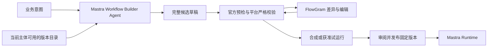

# AI 工作流生成、修改与发布校验方案

日期：2026-09-07。对应[AI 编排契约](../../.scratch/agent-platform/issues/09-ai-authoring-contract.md)。沿用已确认的 FlowGram 编辑、Mastra 执行及“AI 修改完整草稿、发布后按版本运行”主线。本文根据固定发布包与确定性探针提出首期节点范围和交互方案，已完成线性子集的 FlowGram 往返实验，完整控制流、表单变量和真实模型质量仍待验证。

## 复用 Mastra 官方构建器

首期建议复用 `createWorkflowBuilderAgent`、官方 authoring playbook/schema、规范化、preflight 和 schema inspection。平台提供经过权限过滤的能力目录、草稿提交工具及发布校验，FlowGram 展示和编辑同一份执行语义。[固定工厂源码](https://github.com/mastra-ai/mastra/blob/c19a93b0956f957581931786645d0597efec41eb/packages/core/src/workflows/builder/agent.ts)。

完整复用边界与 22 项确定性 SDK 发现见[官方构建器研究](../research/mastra-workflow-builder-2026-09-07.md)。特别是 Code 的保存工具会直接注册在线工作流，不能直接作为平台生成草稿的完成工具使用。

构建器获得的目录只含当前租户/项目/环境可用的发布绑定，目录内容自身也符合客户内容政策。它可以自动完成节点选择与连线、变量绑定和子流程候选，不需要业务人员先手工画完整图；构建器不会因此获得新的工具执行权、Secret 或内容传输许可。

## 一份语义定义，编辑布局单独保存

建议以受限的 Mastra authoring definition 承载执行语义，平台封装 schema/adapter 版本、依赖绑定与 FlowGram 布局信息。FlowGram 节点与连线必须能无损映射回该语义定义，不能同时维护两份未经一致性检查的权威执行图。

布局位置、折叠和视口不影响执行摘要；节点 ID、调用点、条件、变量引用和依赖版本会影响执行语义。需要分别判断“仅布局修改”和“执行行为修改”。最终如何保存画布文档与规范定义由往返原型验证，当前不引入另一套后端执行语言或引擎。

Mastra 动态定义是有序结构化图。建议首期以结构化控制流为编辑约束；即使选用可自由摆放的画布，也不允许画出不能编译的跨容器边、隐式合流或任意环。不能悄悄删除不支持的连线后显示发布成功。

## 首期建议的节点与结构

| 能力 | 建议首期范围 | 必须明确的语义 |
| --- | --- | --- |
| 输入、输出与串行 | 支持；作为流程 schema、步骤顺序和显式投影 | 输入输出类型独立校验，不自动把任意对象变为 Agent prompt |
| Tool | 支持授权版本的工具及受限 Skill 脚本工具 | 模型不生成 endpoint、Secret 或任意执行命令 |
| Agent | 支持已发布 Agent 绑定，节点可自主选获准工具 | 节点运行预算包含内部模型与工具调用；与编排生成会话分开 |
| mapping | 支持常量、字段引用和受限字符串模板 | 类型转换明确；需要运算时使用已登记的确定性工具 |
| parallel | 支持受限数量分支和显式汇总 | 结果按调用点引用，分支失败行为沿用统一恢复契约 |
| 条件 | 支持多命中；如提供“首个命中/if-else”，平台编译为互斥 predicates | Mastra 原生 conditional 为所有命中并行执行；界面必须标明模式 |
| foreach | 支持有限输入集合、明确并发上限和总预算 | 裸数组输入、单项作为 body 输入、结果保序；数量与并发在运行边界检查 |
| 子工作流 | 支持固定发布依赖；复杂分支可生成同一草稿 bundle 的 helper 候选 | 父子一起审阅；调用点 ID 与资源版本 ID 分开，禁止递归依赖 |
| 任意 while/until 回环 | 首期暂不开放，保留后续可验证的有界循环入口 | 原生 loop 无 maxIterations，且先执行后判断，不能只在表单写次数就承诺生效 |
| 长等待、定时启动 | 不作为 AI 草稿默认可注册能力；在恢复/调度契约通过后加入 | 草稿生成不能顺带建立 schedule 或启动真实任务 |

此范围足以覆盖合成文档入库和订单报告。该表是待审阅的首期子集；如果首期需要任意循环、复杂长等待或定时自动运行，必须扩展相应运行证据和验收。

当前 Mastra authoring 子集的 parallel/conditional children、foreach/loop body 仅允许 agent/tool/nested workflow，mapping 需要顶层线性步骤。多步骤分支因此通过 helper 工作流表达。实际限制、循环和并发探针见[固定版本研究](../research/mastra-workflow-builder-2026-09-07.md#控制流与预算)。

## 生成和修改的交互

1. 用户描述目标、输入、输出与业务限制；平台提供可用资源目录和已有草稿修订。缺少关键业务意图时只追问该缺口，其余部分可以生成候选。
2. AI 提交完整候选定义，附修改原因与未满足条件；服务端独立校验。AI 的“校验通过”文本不作为通过依据。
3. FlowGram 同时展示候选画布和结构差异，突出新增/删除节点、变量、条件、工具版本、数据位置、模型服务、写入或批准变化。仅坐标变化单独呈现。
4. 用户可接受候选、继续自然语言修改、手工编辑或撤销。每次修改记录基础修订；若期间已有编辑，返回冲突并重新基于最新草稿生成，不能覆盖用户的新修改。
5. 通过预检后可试运行；发布时再检查当前资源/内容/模型许可和版本可用性。已发布版本独立保留，新草稿不会修改正在运行的图。

可以在提交接口中采用“完整候选 + baseRevision”的方式，服务端计算差异和撤销记录。这样 AI 可以改完整流程，同时避免依赖模型生成的任意 JSON patch 路径作为权限边界。编辑事件的具体存储与历史深度由规格阶段确定。

## 发布校验应逐层执行

| 校验层 | 要拦截的例子 |
| --- | --- |
| 输入与规范化 | 非 JSON 值、重复 ID、非法 optional/null、超大草稿、无法解析的 mapConfig |
| 官方 schema/preflight | 非法结构、字段组合、缺失组件与明确的不兼容输入输出 |
| 完整授权目录 | 模型编造组件、只有工具 registry 而漏掉 agent/workflow、已撤销或其他环境的依赖 |
| 平台变量与类型 | `${initData.n + 1}` 这类被原生模板当成字段名的写法、不存在字段、条件分支可能缺失的必需输出 |
| 控制流与预算 | 过多并发/foreach 项、禁止循环、过深 helper、超时或总工具预算缺失 |
| 版本、身份与数据 | 浮动依赖、未获准写入、内容越域或进入未许可模型、错误业务执行身份 |
| 试运行与发布状态 | 未完成适用用例、运行结果不符合输出契约、部分 bundle 注册失败但切换了发布指针 |

preflight 缺少某类 registry 时会跳过该类引用检查，schema 兼容性也可能为 unknown；平台不能把它们等同于兼容已验证。未知 schema 需要明确适配和运行边界校验，不凭模型推断自动发布。

[发布契约实验](../research/release-contract-probe-2026-09-07.md)进一步验证了 42 项检查：布局与执行摘要分离、固定子流程/工具装配、非法变量与越权引用拒绝。normalize 与 schema 验证必须显式分开；mapConfig 字符串先严格解析成对象，再与对象形式使用同一来源互斥校验。预检目录需要 JSON Schema 记录，实际装配使用服务端固定注册键；不能直接传 Tool/Workflow 实例代替 schema 索引。

固定版 JSON Schema→Zod 转换没有执行本次测试的 `maxItems` 和 `minimum`，因此平台对外部输入、节点输出及数量/并发预算进行独立校验。不能让模型填入上限字段后就认为运行受限。[固定转换源码](https://github.com/mastra-ai/mastra/blob/c19a93b0956f957581931786645d0597efec41eb/packages/core/src/workflows/dynamic/json-schema-to-zod.ts)。

## 有限修复与试运行

建议一次生成默认最多自动修复两轮，受模型调用、token 和总时长预算共同限制；这只是可调整的工程初始值，不是业务 SLA。错误包含节点/字段位置与可用修复方向，修复不能扩大权限或偷偷替换成其他工具。仍有缺口时保留候选及错误供用户继续处理。

“试运行”是真实执行语义。默认使用合成输入与测试工具绑定，尤其是订单写入；换会话 ID 或临时内存不会消除外部副作用。需要使用真实测试环境时仍检查相应授权与动作批准，并明确产生的业务记录。

首次原型先用确定性候选验证提交、编辑往返、差异和拒绝行为，再接入许可模型测生成成功率、修复轮数和用户意图符合率。前者通过不等于 AI 编排质量已通过。人工审阅也不替代服务端结构和资源校验。

## 原型验收样例

- **文档入库**：解析文档 → 分块 → 有限 foreach 调用“处理单块”子流程 → 显式汇总 → 提交本次索引批次。AI 增加格式验证后，旧草稿和旧运行仍可追溯。
- **订单报告**：查询授权订单 → mapping 构造 Agent 输入 → Agent 结合获准知识库给建议 → 固定 Skill 入口生成报表；新增业务跟进写入时展示动作确认变化。
- **语义反例**：两个条件同时为真、多步骤分支需 helper、变量缺失、foreach 超预算、生成了未注册工具、修改期间用户已编辑、helper 发布失败。

对应[FlowGram/Mastra 原型](../../.scratch/agent-platform/issues/10-flowgram-mastra-prototype.md)需要取得实际画布和 Runtime 证据；它仍依赖发布与恢复契约。当前已补充局部前端画布事实，不宣称完整 AI 生成、复杂控制流或正式发布已通过。

可用的机器可读起点是[实验草稿 schema](../../.scratch/agent-platform/research/release-contract/draft.schema.json)与[合成草稿](../../.scratch/agent-platform/research/release-contract/evidence/example-draft.json)。它们只涵盖局部契约，用于后续画布适配对照，不定义首期最终节点集或正式公开接口。

## FlowGram 局部实测补充

[实际往返报告](../research/flowgram-roundtrip-probe-2026-09-07.md)验证了 Tool/mapping/固定 helper 的真实画布、编辑重载和 Mastra 执行。编辑封装保存 workflow schema，图只保存一份，导出后按连线求顺序。不能只调用 document.fromJSON 做整稿替换，不能让默认序列化丢弃未知执行字段，也不能把 pure data 的 updateExtInfo 当作完整修订历史。

1.0.15 的默认位移 operation 与历史监听服务存在实例差异；公开 BaseService 和实际拖动已有撤销/重做证据。该限制由适配层封装并作为升级回归项；完整表单与变量系统仍需下一步验证。本节不改变上文尚未确认的首期节点子集。
