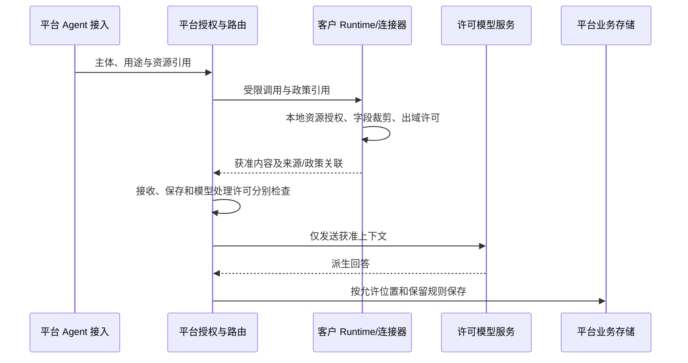

# 内容传输、保留与撤销方案

日期：2026-09-07。对应[内容策略生命周期决策](../../.scratch/agent-platform/issues/20-content-policy-lifecycle.md)。平台托管存储、客户私有资源默认驻留、混合位置、模型与正文许可已经确定；用户进一步选择撤销与副本删除分别处理，可在撤销时勾选删除受管副本。具体保留天数、离线许可期限和客户模板尚未确定。

## 建议采用的三层规则

1. **能否获取和使用内容**：由主体、资源、操作、用途及当前授权决定。
2. **能否把内容传到指定位置并交给指定模型**：由来源、目的地、内容类别、字段范围和处理用途决定。
3. **传输后能否保存、保存多久、谁能查看及如何删除**：独立定义副本和派生内容生命周期。

允许检索不等于允许下载原文；允许返回片段不等于允许发给任意模型；允许平台暂时处理不等于允许无限保留。平台托管资源在获准范围内正常保存会话、文档和产物，客户私有资源的跨位置政策不变成平台全局禁止存储。

## 内容描述与授权记录

建议每个受管内容或片段关联以下属性，字段名只是概念模型，尚未发布 API schema。

| 信息 | 作用 |
| --- | --- |
| 来源资源与版本 | 追溯到文档、工具调用、Skill 包或会话，不只记录一个自由文本标签 |
| 所属租户/项目/环境与位置 | 解析默认存储、执行方与跨位置判断 |
| 内容类别与范围 | 如原始文档、检索片段、结构化订单字段、工具文本、附件、对话、报告、Skill 内容、诊断正文 |
| 派生关系 | 哪些源内容参与了分块、embedding、摘要或报告 |
| 允许用途/目的地/模型服务 | 分别表示检索、生成、调试、业务展示及获准处理方 |
| 保存和删除规则 | 是否可持久化、保留模板、到期时间、删除状态和副本位置 |
| 授权修订 | 判断当时依赖的政策及后续撤销影响，不把旧决定永久缓存 |

内容类别由资源维护者和可信处理规则赋予。模型对内容的总结或第三方工具的自报标签不能自行把限制降级。无法可靠分类的内容应保留来源的约束，交由明确政策处理。

一份传输许可至少绑定授权主体、来源资源范围、内容类别/字段、目的位置、用途、允许的模型服务及保存范围。平台运营的正文查看许可另行判断，不能因为客户允许平台托管，就让运营人员读取正文。

## 一次混合调用如何判断

例：平台托管 Agent 从客户私有知识库取片段，查询私网订单，调用客户许可的外部模型，最终在平台存会话和报表。

私有端在内容离开前执行出域检查；平台不能先接收全部正文，再靠页面遮罩完成私网驻留。平台端继续检查接收目的、模型服务和保存规则，防止从原本允许的目的地再转给未许可模型或其他应用。

embedding、重排、OCR、摘要和回答生成都可能把内容交给模型/处理服务，不只聊天最终一步需要许可。传输给工具的输入同样可能含业务内容；请求方向也要检查，不能只限制返回值。

流式消息和附件下载每次跨越内容边界都遵循相同政策。客户端回调、SDK 事件、iframe postMessage、错误遥测和 tracing 是实际数据出口，不能以技术实现名义豁免。

## 派生内容与副本

建议分块、向量、摘要、报告及模型回答保留来源关联，并继承参与内容的相应限制。组合多个来源时，目的地和用途必须同时被各来源允许；不能用“经过 AI 总结”自动把内容变成公开数据。经明确批准的脱敏/聚合规则可以产生新的发布对象，但需要可审查的规则与证据。

文档删除时，原文、片段、索引、缓存和已登记副本分别具有处理状态。引用不能静默跳到另一版本。报告若引用已删除来源，后续可见性由其自身保留许可和来源约束共同决定；系统保留“已删除/不可用”的引用状态，不能通过历史接口绕过删除政策。

外部业务系统或用户下载产生的非受管副本不能保证被平台远程擦除。对受管副本可执行删除并记录确认；外部处理方只能记录其支持的删除请求与确认范围。技术方案不声称能回收已被读取的内容。

## 撤销是三个动作

| 动作 | 立即产生的逻辑效果 | 不应混淆的事情 |
| --- | --- | --- |
| 撤销获取/传输许可 | 拒绝新的相应读取、传输或模型处理；更新授权修订 | 不自动证明进行中调用已结束 |
| 停止进行中使用 | 请求停止仍依赖该许可的处理，按已定义的租约/在线校验时限生效 | 取消不能撤回已经发送的字节或已发生的业务写入 |
| 删除受管副本 | 对指定位置和派生对象执行删除，跟踪待处理/完成/失败 | 不能在收到撤销请求时就显示所有数据已删除 |

产品界面分别显示这三类状态。用户已选择撤销与副本清理分别处理，撤销时可勾选删除受管副本；未勾选时按独立保留/删除规则处理。允许保留哪些审计元数据及历史产物仍由客户模板确定，本方案不自行选择具体天数或一律删除。

正在运行的任务应在有影响的内容访问/传输/模型步骤重新判断有效许可；断网时采用多长策略租约、到期如何暂停，由[Runtime 恢复契约](../../.scratch/agent-platform/issues/07-runtime-failure-contract.md)统一决定。不能无限继续使用最后一次成功授权，也不能承诺断网时即时撤销。

## 工作流检查点也是业务内容

[跨进程实验](../research/workflow-persistence-probe-2026-09-07.md)已确认 Mastra 的持久化快照包含初始输入、节点输入/输出与挂起内容。它不能被归类为无正文状态而默认复制到集中控制面；完整快照应保存到获准位置，运营页面使用受约束的状态投影。

只有临时处理许可时，不能直接开启包含该正文的完整快照持久化。需要持久化挂起/恢复的流程，应在发布或运行准入时检查必要保存许可；受限引用、可重取输入等替代方案须另行验证，不能凭去掉日志就宣称已解决。客户删除检查点或恢复所需附件后，运行可能无法恢复；删除界面需展示受影响运行，但不能以恢复需要为由绕过已生效的删除规则。该实验补充内容覆盖面，不自行确定保留天数。

## 控制面与诊断信息

建议控制面默认接收不含正文的标识、版本摘要、结构化状态码、时间和计数等管理信息，字段清单按客户政策固定。资源名称、描述、文件名、工具 schema 中的示例、堆栈和输入校验错误可能带业务内容，不能自动算作可公开管理字段。

默认诊断返回稳定错误码和关联 ID，详细业务错误正文保留在获准存储位置。查看正文必须走内容授权，日志搜索和附件下载不能成为旁路。审计记录区分“授权决定和动作已发生”与“保存全部请求和响应”；后者只有在内容政策许可时才保存。

## 验收反例

| 输入或变化 | 必须观察到的结果 |
| --- | --- |
| 订单只许可汇总字段，MCP 文本里又包含完整明细 | 整份返回消息均处理；明细不能通过另一内容字段绕过 |
| 片段可回平台，仅许可客户自有模型 | 外部回答模型、embedding 或重排服务均不能收到该片段 |
| 报表由两个不同限制的知识库生成 | 继承来源与用途限制，不能因输出是新文件而丢失约束 |
| 内容可临时处理但不可保存 | 会话历史、debug、trace、缓存、附件均不保留该正文；输出仍符合派生政策 |
| 撤销传输许可，平台已有受管副本 | 新传输拒绝；既有副本的继续使用与删除状态可分别核对 |
| 错误包含上传文档的一行正文 | 集中状态只含获准错误信息，详细错误不越过内容边界 |
| 平台运营拿到 run ID | 未获正文许可时不能经日志、会话、附件或模型 trace 读取正文 |

方案需要后续用合成 canary 贯穿消息、日志和存储验证；仅检查数据库某张表为空不构成“没有内容外流”的完整证据。

## 尚待客户模板明确的数值与默认值

原文/片段/对话/产物/审计各保留多久、删除时限、离线许可期限以及备份到期规则尚未确定。撤销时可选择删除副本的行为已由用户确定。可通过租户默认模板与项目环境覆盖降低配置量；正式交付前需把默认模板和客户覆盖规则填实，本方案不暗含无限期保留。

当前决策保持 claimed。已确认的混合放置和内容访问方向继续有效，尚未确定的保留模板不会被写成已生效政策。
