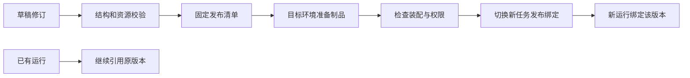

# 发布、版本固定与旧版本清理方案

日期：2026-09-07。对应[发布与版本决策](../../.scratch/agent-platform/issues/08-publication-and-version-pinning.md)。状态：候选工程方案；发布后按版本执行已经由用户确定，具体激活、回滚和保留政策仍待收敛。本文不把草稿或框架动态注册视为正式发布。

## 一次使用怎样选中版本

业务侧通常使用稳定的 Agent/工作流标识，环境的发布绑定决定新任务使用哪个发布版本。在任务被 Runtime 接收时，该选择被固定到运行记录。之后读取草稿、发布 v2 或把环境切回 v1，都不改写已有任务的发布引用。

生成的 SDK 可以提供“使用环境当前版本”和“使用显式发布版本”两种调用入口；后者仍受环境允许版本、主体权限和停用策略约束，不能凭猜测旧 release ID 绕过停用。准确参数与类型由 OpenAPI 生成，本文不手写 SDK 接口。

| 概念 | 含义 | 变化方式 |
| --- | --- | --- |
| 逻辑能力标识 | 业务团队认知的某个 Agent 或工作流 | 保持稳定，供目录与业务集成引用 |
| 草稿修订 | 人工或 AI 可修改的一次候选内容 | 修改产生新修订，用作冲突检查和审查 |
| 发布版本 | 固定定义与依赖的不可变快照 | 内容变动产生新版本，不能原地覆盖 |
| 环境发布绑定 | 某项目环境对新任务默认使用的版本 | 在就绪检查后切换，保留变更记录 |
| Runtime 装配记录 | 某运行环境实际具备的制品与兼容性证据 | 准备、就绪、停用或回收，与发布版本分开 |
| 运行绑定 | 某次已接收任务选定的发布及执行位置 | 同一运行保持固定；不能在恢复时重新查 latest |

跨进程实验已复现同 workflow ID 覆盖后的 v1/v2 混用。因此平台发布版本需映射独立的 Mastra 执行 ID；工具和其他依赖还要验证实现内容，不能只在名字末尾加版本号。[实验依据](../research/workflow-persistence-probe-2026-09-07.md)

后续[发布契约局部实验](../research/release-contract-probe-2026-09-07.md)已用 42 项检查验证候选清单：布局单独存储，编译器/schema/锁文件及依赖摘要进入发布身份，工具与子流程按内容派生标识装配，旧版本保持可用。实验的可信根与授权来自本地夹具，不能替代本文尚待实现的正式发布、签发和激活协议。

## 发布清单固定什么

以下为概念字段，供后续规格使用，不是已经发布的 API schema。

| 固定项 | 应记录的内容 | 运行期仍会变化的部分 |
| --- | --- | --- |
| 工作流 | 规范化执行定义及摘要、输入输出契约、独立执行 ID | 运行状态、具体输入、当前使用权限 |
| Agent | 指令、模型调用配置、已绑定工具/Skill/知识库能力与预算 | 模型本身的非确定性输出；服务可用性和授权修订 |
| 工具/子工作流 | 能力版本、实现制品/适配器摘要、嵌套依赖清单 | 业务数据、实际凭据、目标服务可用性 |
| Skill | 标准包版本/内容摘要、脚本入口和提前准备的执行环境 | 当次输入/输出、当前资源范围与动作批准 |
| 知识库依赖 | 检索配置、知识库身份、资源位置及可支持的索引兼容条件 | 文档和 ACL 可以按知识生命周期更新，不能自动声称数据全集也冻结 |
| 模型服务 | 服务身份、请求的模型版本/名称与参数、允许的处理用途 | 远端是否真正固定权重/别名，由服务能力决定 |
| 执行兼容性 | 平台编译器/适配器版本、Mastra 范围、镜像或运行包摘要、必要状态迁移版本 | Secret 轮换与当前授权不复制进制品 |

对于纯 Agent，发布清单同样存在，无需先创建工作流。文档处理工作流复用相同版本规则；具体文档快照、索引批次和引用保留交由知识库生命周期定义。

“版本固定”保证可追踪的配置和实现选择，不保证模型每次回答逐字一致，也不保证第三方永远保留旧业务行为。远端只提供 latest 实现的工具，应显示契约固定但实现无法冻结的限制；不兼容时阻断调用，不能宣称平台能回滚远端。

Secret 只通过获准位置的引用解析。轮换到同一业务身份、权限不扩大的凭据可以作为运行绑定更新单独审计；主体、目标服务或动作语义变化应重新审核绑定。凭据失效和授权撤销可以阻断旧版本，固定版本不授予永久权限。

## 从草稿到新任务可用

1. AI 生成与人工修改都作用于草稿。服务端对 base revision、节点/变量/schema、完整依赖、预算、身份和内容位置做校验；AI 的提交不能直接调用动态注册执行或切换生产入口。
2. 固定发布清单，保存内容摘要、创建者和来源修订。实际包体留在允许的资源位置；控制面只持有获准的清单信息和引用，不能为“发布打包”强制集中复制私有 Skill/指令/工具说明。
3. 在所需 Runtime 准备对应制品、版本工具和子流程，校验摘要及执行兼容性。即使 Mastra startWorkers 返回成功，也需检查所需执行 ID 和全部依赖确实装配成功；缺失旧工具的实验已证明只看启动成功不够。
4. 目标环境做准入与就绪检查。默认只做结构、装配、只读健康和明确的合成测试；发布验证不自动对真实业务系统执行写入。
5. 有权限的发布者确认待激活版本与变更范围后，条件更新该环境的新任务发布绑定。请求重试须幂等，过期的环境修订不能覆盖别人刚发布的版本。是否额外要求独立审批者由客户角色策略决定，既有发布权限不自动扩张。
6. 接入方选择明确的发布修订并传给 Runtime；Runtime 验证该绑定仍可接收新任务及当前政策后，持久化运行与版本引用，再确认接收。

准备和激活分开，**不承诺跨客户网络的分布式原子发布**。一个目标失联时显示其实际准备状态；只有策略要求的目标均满足条件，才允许改变相应环境的新任务入口。已经切换的绑定也不代表所有资源永远在线，之后的断网仍由恢复契约处理。

如果准备阶段部分制品写入成功、随后失败，保留为未激活材料并可重试/清理，原环境入口继续有效。Mastra 的多定义顺序保存不作为平台发布事务；平台自己的发布记录与入口更新需要原子条件检查。跨环境分别激活，不以一个全局“已发布”状态隐藏差异。

新任务的版本切换需要明确的受理边界。私有 Runtime 直接接入必须使用有效的环境修订；离线是否允许受理新任务由[恢复契约](runtime-recovery-contract-proposal.md)决定。当前候选默认不在断网时新增任务，不能在控制面已切换后让断网节点无限沿用旧入口。

## 回滚、恢复与重新执行的区别

| 操作 | 新任务 | 已有任务 | 限制 |
| --- | --- | --- | --- |
| 环境从 v1 发布 v2 | 完成激活后的受理使用 v2 | 已接收任务仍绑定 v1 | 不自动修改运行中的计划 |
| 环境从 v2 回滚 v1 | v1 就绪且仍获准后，新任务使用 v1 | v2 已接收任务仍绑定 v2 | 回滚不撤销已发生的业务写入 |
| 恢复挂起/崩溃任务 | 不创建新的业务意图 | 使用原发布与必要检查点 | 旧制品、数据或授权缺失时阻断 |
| 重新执行一次任务 | 创建新运行，明确所选版本和输入 | 原运行历史不改写 | 重新判断权限、审批及业务动作语义 |
| 撤销有问题的发布 | 禁止新的相应受理 | 停止受影响能力的新操作并按恢复契约处理进行中调用 | 即使回滚成功也要处理已发出的不确定动作 |

首期建议不提供进行中任务的自动跨版本迁移。若旧版本必须淘汰，先列出受影响运行，选择保留兼容执行环境、取消任务或经核对后新建运行；需要跨版本状态迁移时再提供独立、可审核的迁移契约。

升级 Runtime 本身也需检查旧发布可否继续装配及旧检查点是否兼容。仅应用入口回滚不能逆转不可逆的数据库迁移；迁移前需有验证和恢复路径，不能把 Docker 镜像切回当成所有状态已回滚。本方案尚未选定正式数据库或迁移工具。

## 旧版本何时可以清理

清理对象至少分为发布记录、执行制品、运行恢复材料和业务产物。它们可以有关联，但不能使用一个“删除版本”按钮隐含删除全部内容。

| 对象 | 建议默认处理 | 与保留模板的关系 |
| --- | --- | --- |
| 环境当前发布与明确保留的回滚版本 | 保留必要执行制品 | 回滚窗口/保留数量由模板定义，不能仅靠按日期删除 |
| 尚未结束或仍在业务结果核对中的任务所需制品 | 因运行引用而保留；卸载前给出受影响清单 | 任务最长等待/恢复期限需有限且可配置，避免无限钉住所有旧版本 |
| 已结束任务 | 保留许可范围内的版本身份与审计关联 | 需要多久可重新装配/重放，另由模板决定；不能默认永久留全部镜像 |
| 检查点、输入、输出和附件 | 按内容类别与获准位置各自处理 | 客户删除/到期优先于便利性；失去恢复材料需显示不可恢复原因 |
| 未激活、无引用的准备材料 | 确认无受理/激活竞争后，可按准备超时清理 | 只清理未引用对象，不影响当前入口 |

建议采用“先标记候选、重新核对引用与运行状态、停止新增绑定、再删除”的回收过程。新接收运行和制品回收要共享一致的引用检查，不能出现清理看到零引用的同时又受理新任务。删除后仍保留获准的版本身份/摘要和删除状态，而不把丢失制品的旧版本显示为可运行。

这是需要用户审阅的保留模型，不是已经确定的生产模板。具体内容期限仍按之前待回答的保留问题收敛；本文没有替客户填写天数，也没有把引用保留解释为删除豁免。

## 应验证的发布反例

| 场景 | 必须观察到 |
| --- | --- |
| 两人/两个 AI 请求从同一草稿修订提交不同修改 | 过期修改明确冲突，不悄悄覆盖 |
| 目标 Runtime 装配缺一个工具；Mastra 启动仍返回 | 该发布不能被标记就绪，不能激活到新任务入口 |
| 准备三个定义，在第二个保存后失败 | 原入口不变；未激活材料可识别，重试不会冒充一次完整激活 |
| 激活请求重试，期间别人已经发布另一修订 | 原请求不能覆盖新修订，历史能还原顺序 |
| v1 挂起时发布 v2，再重启恢复 | v1 的定义及实现摘要一致，不只结果文本相似 |
| 回滚新任务入口时，v2 仍有已发出的写入 | 新任务走 v1，原动作继续按 v2 的记录核对，不自动重复/撤销 |
| 旧制品准备清理的同时有新运行尝试绑定 | 引用与受理互斥正确，不出现接收成功但材料被删 |
| 原文/检查点已到期，旧镜像还在 | 不能凭镜像存在恢复已无权限或缺失的数据 |
| 客户禁止 Skill 包内容出私网 | 发布仍使用获准位置的制品引用，不通过日志/控制清单复制包体 |

这些场景是后续原型的验收输入，尚未完成平台实现。当前已通过基础 SDK 与[局部 FlowGram 往返实验](../research/flowgram-roundtrip-probe-2026-09-07.md)；完整控制流、AI 完整生成、环境激活事务和真实客户 Runtime 升级仍需验证。
