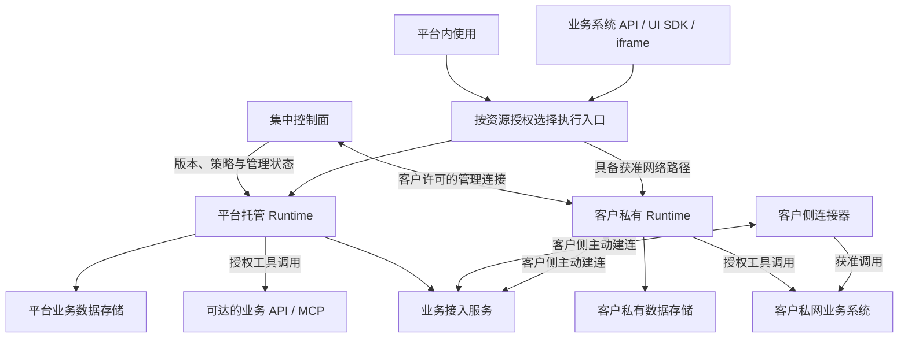
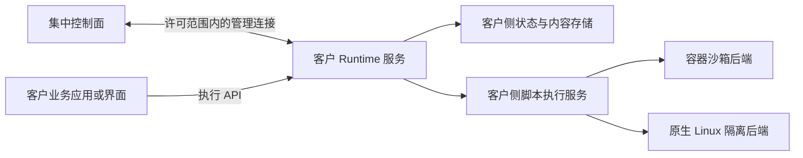

# Runtime 托管位置与安装方案

日期：2026-09-07。状态：平台存储与业务执行、混合资源、客户侧主动连接及 Runtime 的 Docker/Linux 交付方向已由用户明确；以下协议与部署细节为待验证设计。来源见[数据与网络边界](../../.scratch/agent-platform/issues/01-data-and-network-boundary.md)及[首期交付与验收讨论](../../.scratch/agent-platform/issues/04-first-release-acceptance.md)。

## 使用入口与托管位置

平台提供控制面、Mastra Runtime 与业务数据存储。用户可直接在平台内聊天、使用 Agent、上传文档和维护知识库，并调用授权工具操作业务系统；业务系统也可通过 API、UI SDK 或 iframe 使用这些能力。

使用入口与运行、存储位置分别配置。平台内使用可以访问平台托管或客户私有资源；业务系统嵌入也可以使用平台托管能力，无需必然自建 Runtime。

| 托管位置 | 执行与存储 | 数据政策 |
| --- | --- | --- |
| 平台托管 | 平台 Runtime 执行；平台保存对话、文档、知识库、Skill 包、工具结果和运行产物 | 按资源归属与权限访问；租户隔离、保留和删除规则待细化 |
| 客户私有 | 客户环境内的 Runtime 执行，并使用客户指定的存储 | 业务内容默认留在私网；跨环境传输遵循客户按类别与范围授权的政策 |

控制面与 Runtime 分离继续成立：平台托管 Runtime 也拥有独立的执行、升级及故障恢复边界。用户已确认同一项目可混合使用：项目环境设置默认位置，知识库和工具可绑定其他位置。跨环境调用、内容传输及复制/迁移的具体规则见[讨论方案](data-placement-routing-proposal.md)，尚未全部定稿。

图中的执行入口是逻辑路由，不表示所有业务正文都经过控制面代理。平台托管 Runtime 调用私网业务系统时，由客户按需部署的连接器或完整 Runtime 承接；主动连接和混合调用的方向已确认，具体连接协议、身份传递和结果策略仍需设计验证。网络可达性、工具操作权限和内容传输政策分别校验。

## 客户侧主动连接：已确认的交付方向

用户已确认由平台提供客户侧组件，经客户许可的出站连接访问平台，在客户没有向平台开放业务入站端口的情况下承接授权请求。连接方式可适配客户许可的企业网络；目前尚未选择具体传输协议，也未验证代理及防火墙兼容性。

| 客户侧交付形态 | 承担的能力 | 适用情况 |
| --- | --- | --- |
| 轻量连接器 | 身份注册、连接维护、受限请求分派、调用上下文与结果范围校验 | Agent 在平台运行，只需调用客户已有的业务 API、MCP 或检索服务 |
| 完整客户 Runtime | 主动连接能力，加上本地 Mastra Agent/工作流、Skill 执行适配与状态管理 | 需要在客户环境完成推理调用、编排、文档处理或脚本执行 |

轻量连接器或完整 Runtime 按需安装已经确定为首期范围，表中的职责划分是设计细化。连接器不会自动提供知识库索引、模型推理或脚本沙箱；这些服务必须在选定环境另有承载。连接能力与 Runtime 可复用协议和代码，是否作为独立进程、安装包或运行模式由[主动连接原型](../../.scratch/agent-platform/issues/21-private-connection-prototype.md)决定。

平台管理服务处理目录和管理消息；业务接入服务承接获准的调用及内容流转，保持与控制面执行职责的边界。客户侧连接组件仅接受已登记资源与获准操作，不能成为可访问任意客户地址的通用代理。客户业务凭据建议在实际调用位置解析，避免为了建立连接而集中复制所有凭据。

连接需要同时处理请求和结果。客户允许的结果返回、私有聊天在集中界面的展示以及附件下载均需各自的内容权限；仅建立管理连接不视为开放上述内容。当客户完全禁止到平台的可达路径时，联网调用能力不可用，不能承诺凭连接器解决网络隔绝。

## 已明确的交付方向

客户私有 Runtime 以 Docker 为首期主要交付方式，同时支持在 Linux 环境直接安装。集中控制面同时管理平台托管与客户私有 Runtime；下面的安装组合重点描述客户交付，平台托管侧复用相同执行契约，具体运维部署另行确定。

Runtime 的安装方式和 Skill 脚本的执行环境是两个维度。Runtime 可以作为普通 Linux 服务运行，再访问独立的沙箱服务；完全没有 Docker 时则需要可满足权限要求的原生执行后端。选用 Linux 安装不改变已经确认的版本与范围授权、隔离执行及数据驻留要求。

## 安装与执行的组合

| Runtime 安装 | 脚本执行后端 | 当前处理方式 |
| --- | --- | --- |
| Docker | 独立的客户侧容器沙箱服务 | 首期优先验证；可比较直接驱动容器与 OpenSandbox 的实际适配成本 |
| Linux 服务 | 同一客户网络内的容器沙箱服务 | 复用相同执行契约；Runtime 本身不必容器化 |
| Linux 服务 | Linux 原生隔离执行器 | 纳入兼容路径，单独验证隔离、依赖及资源控制；不使用无隔离的宿主进程回退 |

以上是设计组合，不是三种实现都已经通过验证。Docker/Kubernetes/OpenSandbox 的能力与条件见[私网研究](../research/private-skill-sandbox-options-2026-09-07.md)，原生路径见[Linux 隔离研究](../research/native-linux-skill-sandbox-2026-09-07.md)。Kubernetes 暂不作为首期客户的安装前提。

## 客户私有部署中两种安装复用的边界

同一套业务 API、版本绑定、权限判断、执行事件和产物引用适用于两种安装。后端差异由执行服务适配，不能向模型开放 Docker API、宿主管理命令或集群管理凭据。

Runtime 的发布版本、Skill 的内容版本和脚本环境版本分别记录。升级 Runtime 不应自动将进行中的任务切换到新的 Skill 或脚本环境；旧运行的保留与恢复规则由发布和恢复决策确定。

具体候选行为已整理为[恢复契约](runtime-recovery-contract-proposal.md)和[发布与旧版本清理方案](publication-and-version-pinning-proposal.md)。前者区分控制面失联、业务连接中断与执行者故障；后者区分制品准备、环境激活和旧运行引用。离线续行与跨主机接管范围仍在讨论，安装支持不能被解释为这些运行承诺已经兑现。

## Docker 交付建议

- 交付可固定版本的 Runtime 镜像和部署配置模板，客户可使用许可的镜像仓库或离线导入方式。
- 将状态、内容、执行产物及必要配置放在明确的客户侧持久化位置；容器重建与数据删除分别操作。
- Runtime 服务与管理沙箱的执行服务采用不同权限边界。只有可信执行服务可以调用容器管理接口，上传脚本和模型均不能访问该接口。
- 沙箱后端明确配置运行用户、只读内容、临时工作区、网络范围及资源预算；普通容器的存在本身不证明全部约束生效。
- 依赖准备结果在发布前固定；执行时记录具体环境制品，禁止因浮动镜像 tag 或临时安装导致版本漂移。

是否使用 OpenSandbox 作为执行服务组件尚未决定。其 API 复用价值与需要补齐的策略必须在目标配置下比较，不能直接沿用默认网络和权限配置。

## Linux 直接安装建议

- 提供固定版本的 Runtime 发布包、配置模板和服务管理示例；实际发行版与架构支持矩阵在首期包验证时列明。
- Runtime 使用专用服务账户；配置、状态、内容与临时执行目录分别管理，服务的工作目录不作为脚本的访问边界。
- 在安装或环境准备时检查 Node.js 及脚本执行环境的版本和能力。Python、Bash 与本地原生依赖由固定环境配置管理，不让 Agent 修改宿主的全局安装。
- 原生执行器需要操作系统级文件/网络限制、进程清理和资源控制。缺少强制机制时报告脚本能力未就绪；普通 Agent 与已授权业务工具的可用性按其各自依赖判断。
- 原生依赖受 CPU 架构、发行版、动态库及 Python ABI 影响；同一个依赖清单不能直接当作跨 Linux 环境可重复的运行产物。

## 原型先验证的安装能力

1. Docker 路径：固定环境启动、版本内容一致性、资源访问限制、超时后进程终止、异常退出后的工作区回收。
2. Linux 服务连接容器后端：同一运行接口与鉴权能否复用，服务重启是否能核对沙箱归属与状态。
3. 无 Docker 的 Linux 路径：宿主前提检查、只读绑定与可写工作区、网络限制、限额和后代进程清理是否实际生效。
4. 客户私有部署的两种安装均检查未经客户授权时，包体、文档、消息及执行结果没有通过日志、遥测或控制面代理离开私网。
5. 平台托管路径检查平台界面和嵌入入口能否复用执行能力，内容是否写入正确的租户存储，后续读取和工具调用是否受到对应资源权限约束。

Docker 路径中固定环境、版本内容、基础隔离、预算、超时与清理已有[首轮 18 组实验](../research/skill-sandbox-prototype-2026-09-07.md)。其他安装路径、许可网络、内容链路及持久化未完成。用户已采用通用合成业务样例、容量先实测；正式客户容量、业务正确性和生产交付仍需客户目标与目标环境证据。
