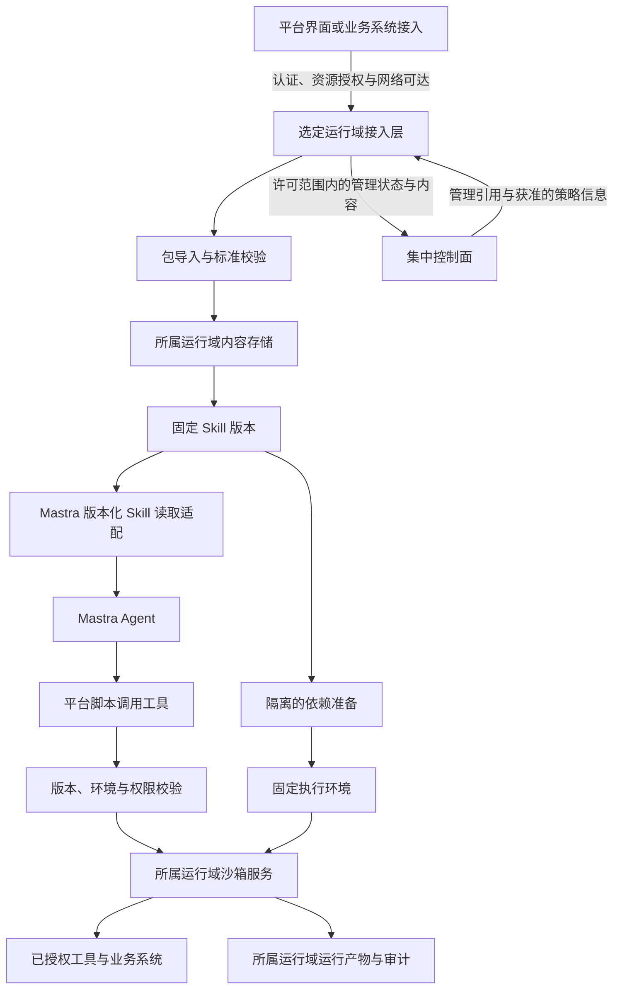

# Skill 运行架构基线

日期：2026-09-07。状态：产品基线与技术设计草案。产品决定以[Skill 决策票据](../../.scratch/agent-platform/issues/03-skill-contract.md)为准。Mastra 1.64.0 的版本读取、平台受限工具及 Docker 基础隔离已有[首轮 18 组运行证据](../research/skill-sandbox-prototype-2026-09-07.md)；网络放行、产物持久化、撤销与客户交付仍未通过整体验证。

## 已有决定

- Skill 采用标准 Agent Skills 包，允许压缩包导入；可由独立 Agent 或工作流中的 Agent 节点使用。
- 按版本与资源范围授权后，在选定 Runtime 的隔离环境中自主执行。平台托管与客户私有 Runtime 复用这一契约；具体业务工具已有的动作审批继续生效。
- 首期以 Node.js、Python、Bash 为基线，依赖在执行前准备并固定。
- 平台可存储 Skill 包与业务内容，并直接执行授权的业务操作。客户私有部署中的文档、对话、工具结果与 Skill 包内容默认留在私网，可按客户明确授权的类别与范围上报。

## 从上传到调用的职责分配



这是逻辑边界图，不要求每个方框部署成独立服务。运行域指本次获准使用的平台托管或客户私有执行与存储环境；用户已确认项目环境的默认位置以及知识库/工具可绑定其他位置。Skill 包的分发、执行和产物位置仍须符合目标运行域的内容与权限政策。平台托管模式下，包体、输入、产物和历史可保存在平台业务存储，平台内与嵌入入口复用同一权限契约。运行域和数据目的地由服务端按授权绑定解析，模型不能自行选择其他租户或存储目的地。

客户私有模式下，浏览器能否访问客户侧接入层需按客户网络验证。浏览器不具备私网可达性时，应使用客户侧界面或企业提供的网络接入；经控制面代理正文需要符合该客户的数据政策，不能作为默认回退。

控制面管理目录、版本引用、权限与发布关系，平台业务存储承担包体和业务内容保存。客户私有资源的包体不默认复制到集中环境；平台托管资源可直接保存在平台。上传 URL、下载引用、运行产物及错误日志均须遵循所选资源的内容驻留边界。客户私有资源允许上报的管理元数据清单仍由数据决策明确；含业务信息的资源名、配置和错误文本不自动归类为可上报元数据。

## 四类记录分别管理

下表是平台侧的逻辑数据模型，不能作为新增必需字段塞进标准 SKILL.md。

| 记录 | 描述 | 变化规则 |
| --- | --- | --- |
| Skill 版本 | 标准包的固定内容、资源标识与内容摘要 | 内容改变形成新版本；同名与可见范围遵循资源授权 |
| 执行环境版本 | 解释器、系统依赖、语言依赖与准备产物 | 准备完成后固定；新依赖形成新环境版本 |
| Skill 授权 | 哪些使用方可在什么环境中，以哪些资源范围执行哪个版本 | 可授予、收窄或撤销，记录策略修订；不修改包内容 |
| 脚本调用记录 | 某次运行使用的 Skill/环境版本、授权修订、入口、输入引用、输出引用及结果 | 与运行和审计关联；记录故障与取消的实际结果 |

包内声明用于描述能力需求，最终授权由平台决定。Skill 版本固定不能被解释为权限永远不变；授权撤销、断网和进行中调用的处理，由[Runtime 恢复承诺](../../.scratch/agent-platform/issues/07-runtime-failure-contract.md)与[发布升级规则](../../.scratch/agent-platform/issues/08-publication-and-version-pinning.md)共同定义。

## 复用 Mastra 的读取能力，收窄脚本调用入口

官方主干的 SkillSource、VersionedSkillSource 与 Workspace/Sandbox 扩展边界见[Mastra 研究](../research/mastra-skill-runtime-boundary-2026-09-07.md)。首轮原型已在实际发布包 1.64.0 验证版本源与 Workspace 发现，并检查最终装配的工具清单；发布包并不因此与研究主干完全等价。平台仍须绑定固定版本与授权内容源。本轮发现原生版本源不重算 blob 摘要，平台读取包装与执行物化须校验实际内容；损坏内容拒绝已有实验支持。

版本内容源负责读取，执行服务仍须将同一版本的脚本物化到沙箱。发布执行不配置草稿或本地磁盘 fallback；组合 source 按授权绑定构建，避免在共享 Workspace 实例中更换客户内容源。请求级 skills resolver 只选择已有 source 内的路径，不代替跨客户内容源隔离。

初步源码核查发现内置 execute_command 接受模型提供的命令字符串。用户本次授权针对固定 Skill 包内脚本，因此技术设计建议使用平台自己的受限脚本调用工具。开放任意 shell 或让模型即时生成代码执行需要额外定义能力范围。

对模型开放的概念接口可表达为：

```text
run_skill_script(skillBindingId, entrypointId, input, inputFileRefs)
```

服务端从已授权绑定中解析实际 Skill 版本、解释器、脚本路径、工作目录、环境和资源限制。调用者提供业务输入与授权范围内的文件引用；入口元数据由平台目录维护，标准包仍保持原格式。具体输入 schema 和参数映射在规格阶段确定。

Skill 读取工具和通用 Workspace 工具有各自的注入路径。实施时需检查最终暴露给模型的工具清单，并限制 SkillSource 可读范围；不能只设置一个通用工具开关就认为所有读取或执行入口均已关闭。

建议使用固定的解释器与参数列表调用已登记脚本，避免模型直接决定 shell 命令、任意 cwd 或环境变量。固定入口仍可能执行第三方代码，操作系统隔离与资源限制必须由实际沙箱强制落实；入口白名单不能替代这些限制。

结构导入符合标准与执行环境兼容分别展示。一个格式合法但依赖未提供的工具、宿主目录或未获准网络的 Skill，应返回明确的兼容性或权限问题，不伪装成标准格式错误。

## 依赖准备与执行隔离

依赖准备会运行安装脚本，也属于代码执行。建议在所属运行域的隔离构建环境中，从许可的软件源准备依赖，保存可重复解析所需的版本和摘要。执行环境可以复用兼容的准备产物，不强制每个 Skill 独占镜像。

执行服务需要自己的“准备完成”判定，覆盖依赖、内容挂载和策略生效，再接收脚本调用。不能将 provider 的 running 状态或 onStart 回调开始视为全部准备已经完成。沙箱缓存按调用隔离与复用策略使用，删除缓存引用不能代替销毁实际环境。

建议的最低执行约束：

- 包内容只读；输入文件按授权暴露；输出写入本次运行工作目录。文件 API 的 readOnly 配置须与沙箱层挂载及权限一致。
- 网络只允许授权的业务工具或明确许可的目标；未经许可的网络访问由执行环境强制限制。
- 长期 Secret 留在对应运行环境的凭据服务，跨环境工具连接的凭据归属需显式设计；优先通过受限工具或短时许可完成访问，避免凭据默认进入脚本和模型上下文。
- 时间、CPU、内存、进程、输出及存储受预算约束；超时和取消要检验进程树及后代进程的实际终止情况。
- 运行工作目录与会话历史分别管理；默认不复用上一业务用户的可写工作区。确需持久化的产物应显式登记并鉴权。

以上是待实现验证的工程约束；具体隔离实现还未选定。平台托管侧同样需要隔离不同客户的内容、凭据与执行工作区，具体租户隔离方式待验证。普通本地进程、框架级路径配置或宿主容器权限不能直接证明这些约束成立。候选对比见[私网沙箱方案研究](../research/private-skill-sandbox-options-2026-09-07.md)。

## 调用生命周期与失败语义

| 阶段 | 校验与行为 | 失败结果 |
| --- | --- | --- |
| 接收调用 | 识别业务应用/用户和运行，分配调用标识 | 未认证或无权使用绑定时拒绝 |
| 解析版本 | 固定 Skill 内容、环境版本和入口 | 内容缺失、摘要不符或版本不可用时拒绝 |
| 校验授权 | 校验当前许可与 Runtime 可落实的限制 | 缺权限或执行环境不支持限制时拒绝，不自动扩权 |
| 准备沙箱 | 挂载所需内容、注入允许的调用上下文 | 记录环境准备失败，不让模型临时安装缺失依赖 |
| 执行 | 记录开始、进度、资源消耗和工具调用关联 | 区分脚本错误、预算超限、取消和结果不确定 |
| 收集产物 | 按文件权限登记输出与诊断信息 | 上传或登记失败保留可追踪状态 |
| 清理 | 结束执行进程并按策略回收工作区 | 清理失败可追踪且不得将脏工作区交给其他调用 |

超时、取消或丢失响应不证明外部业务动作没有发生。涉及写入的工具仍需业务幂等、查询确认或人工处理；脚本调用标识只提供关联基础，不构成 exactly-once 承诺。

## 后续原型需要证明什么

| 场景 | 必须观察到的结果 |
| --- | --- |
| 合法标准包导入 | 内容可按固定版本读取，正文、资源及脚本不会混用其他版本 |
| 模型尝试任意命令 | 对外工具不接受任意命令或目录；固定入口不能通过参数变成另一个解释器入口 |
| 越权读取 | 脚本无法读取其他 Skill、其他运行和宿主的未授权文件 |
| 网络越权 | 未授权地址被执行环境限制；许可目标按规则可达 |
| 缺失依赖 | 返回环境不满足，未发生运行中自动安装 |
| 子进程与超时 | 不只请求返回超时，后代进程也按规则结束 |
| 授权更新 | 按后来确定的撤销/离线契约处理，不能以包版本固定为由忽略撤销 |
| 客户私有内容的跨环境传输 | 未经客户相应授权时，集中环境的请求体、日志和遥测不包含私网包体、输入正文或运行结果正文 |
| 平台托管内容的存取 | 平台内与嵌入入口均能保存和读取获准内容；不可跨租户读取包体、历史与执行产物 |
| 并发与工作区复用 | 不同调用不能互读临时内容，异常清理不会污染下一调用 |
| 外部写入后失联 | 能区分不确定结果，并通过已确定的恢复策略处理 |

表中一部分要求已取得[首轮运行证据](../research/skill-sandbox-prototype-2026-09-07.md)：固定入口、版本一致、基础文件/网络隔离、预算、并发、取消和清理。许可联网、导入归档、运行中授权更新、跨位置内容、持久化和外部副作用仍未验证。用户已明确 Docker 为主要交付方式，同时支持 Linux 直接安装，参见[部署方案](runtime-deployment-profiles.md)；具体发行版、架构、容量及恢复指标仍需后续证据。
