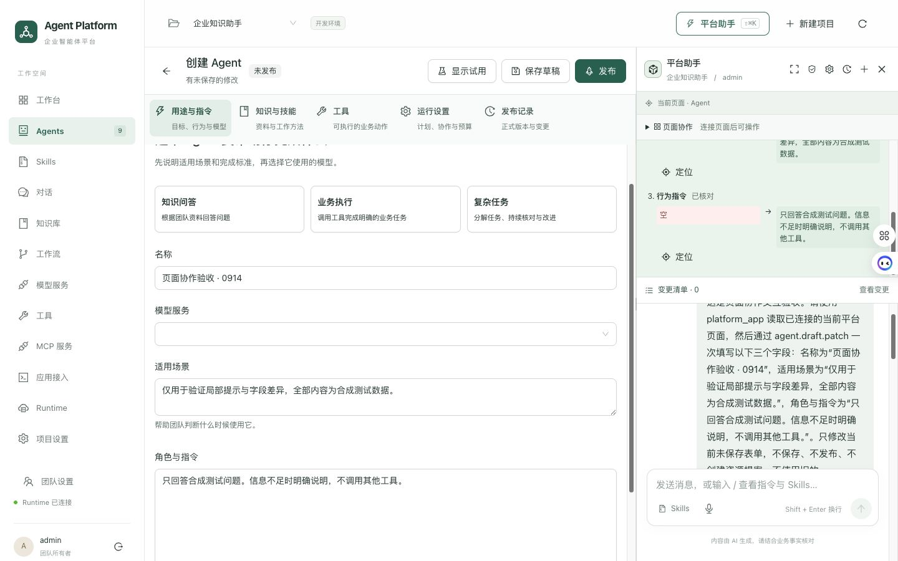
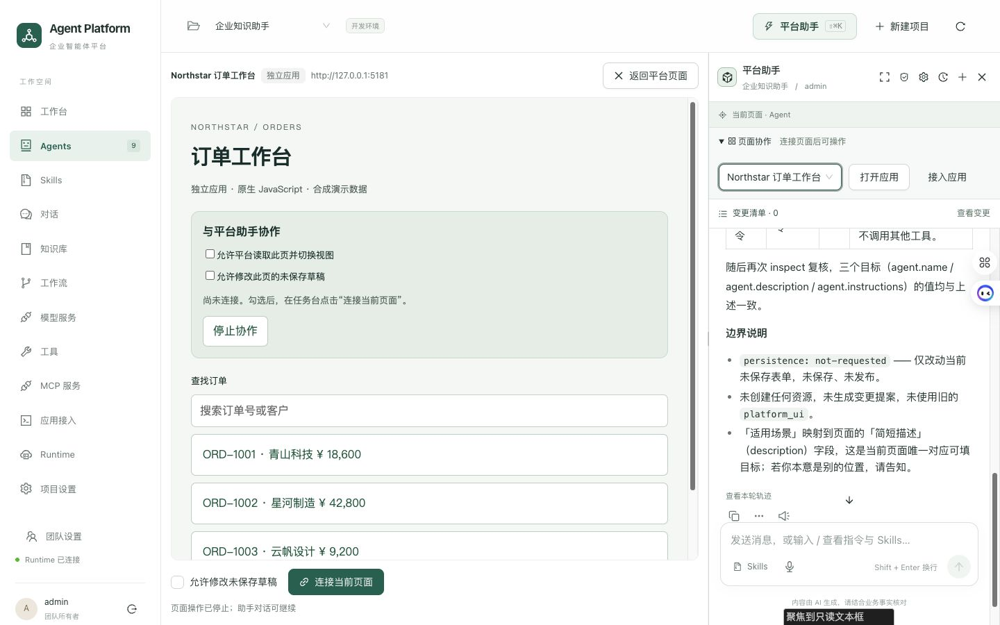

# 平台助手页面协作体验 · 第一阶段交付

本次实现调研方案的 P0-A 与 P0-B，基于 `fc61921dc6fc4876e8e0918949d39ebcd941a861`，改动目前在本地工作区。设计背景见 [体验调研](assistant-page-operation-ux-2026-09-14.md)。

## 已实现

- 用 Ant Design Splitter 把业务页面与助手放进同一布局，移除主入口的 Modal 和遮罩。默认侧栏宽 420px，可拖动、主动展开，按用户和项目记住当前浏览器会话内的宽度。
- 页面操作、页面切换不再自动收起助手。收起后保留会话和输入内容，顶栏仍显示协作连接状态及「停止页面操作」入口。该按钮只停止页面协作，不代表停止整段 Agent 对话。
- 变更清单按需切换，对话和未发送内容保持挂载。Agent 草稿试用与助手互相让出位置，已有试用内容保留。
- Agent 配置导航按页面可用宽度切换排列；小屏用页面/助手视图切换。工作流画布打开助手时也限制在业务页面区域内。
- 第三方 iframe 改放主工作区，来源、授权和连接控制在旁边可见；「返回平台页面」关闭应用并停止协作。现有 origin、sandbox、短租约和停止规则保留。
- 应用通过注册的稳定目标 ID 提供局部目标，模型不能传入任意选择器或 JavaScript。操作前绘制提示，字段提交后核对真实 React 状态，再形成步骤结果。局部 BorderBeam 仅作强调，不拦截鼠标、不抢焦点、不增加固定执行等待。
- 最近一次操作提供紧凑摘要、已核对字段的原值/新值及定位入口。原始 JSON 收进技术详情；字段差异会进入工具回执，重载会话仍可查到。
- 多字段发生人工修改时停止后续写入，只保留已经核对的变化。未执行与结果未知分开显示。重复请求返回同一回执，冲突请求与并发拒绝不会覆盖正在展示的动作。平台等待服务端确认回执后才显示完成。

内置应用 manifest 版本更新为 `1.1.0`，为输出增加可选 `changes`；通用 bridge 协议仍为 `1.0`，没有引入跨应用进度事件。持久化差异只针对内置 Agent 的三个草稿字段，单个原值/新值上限 2,000 字，截断会标明；页面本地结果可查看完整值。

## 真实流程验收

在已登录的 Edge 中用新建、未保存的 Agent 表单执行合成任务。没有改动原「前端专家」资源，也没有保存或发布验收 Agent。

- Run：`20cd1d0e-ed4f-4f78-8349-9c30ac1fa073`
- Conversation：`594f7349-8745-425a-8e0c-8b2933dfb807`
- 助手调用 `platform_app` 读取当前页面、查询动作规范，并执行一次 `agent.draft.patch` 填写名称、适用场景和角色指令，之后再次读取核对。
- 浏览器显示三个实际值与请求一致，表单显示未保存修改；工具卡与侧栏提供三项差异。数据库只读核对确认 Run 和应用动作均为 `succeeded`，`uiApplied=true`、`persistence=not-requested`，回执保存三项已核对变化。
- 收起后从顶栏停止页面协作，重新打开时对话和草稿仍保留。测试草稿随后随开发热更新丢弃，未写入资源。

截图采集时操作标签仍为旧名称；交付代码随后将注册标签对齐为页面实际显示的「名称 / 适用场景 / 角色与指令」。静态截图不代表已经测得动画帧率或完成读屏验收。

原生 JavaScript 示例 Northstar 订单工作台已在主工作区打开并验证布局、关闭返回；本次没有让模型操作示例订单。跨应用的细粒度动作反馈仍属于下一阶段。

浏览器另行验证了 1440×900、390×844 和原始宽屏尺寸，覆盖导航不收起、窄屏重新进入、试用面板让位、分隔线拖动及重载后恢复 510px 测试宽度。工作流画布和助手的实际矩形相邻且不重叠。验收结束恢复原浏览器尺寸、默认 420px 助手宽度和原 Agent 页面。

开始时本地 Runtime 未运行。只读队列检查确认只有本次验收 Run 待执行，随后恢复了 Runtime，`/ready` 返回 ready；也启动了已有的 5181 示例服务供布局验收。

## 自动检查

`pnpm check` 最终退出码为 0：Biome、架构边界、服务/SDK/Console 构建、TypeScript 和 SDK 生成一致性均通过；后端/协议测试 153 通过、4 跳过，Console 测试 168 通过，合计 321 通过、4 跳过。

最后的工作流定位 CSS 修正另行通过 `pnpm lint` 与 Console 生产构建；`antd lint apps/console/src --diff HEAD` 扫描 11 个文件无问题，`git diff --check` 通过。构建仍有大分块提示，测试环境仍有部分 JSDOM 样式解析及既有 ChatWorkspace key 提示；本轮未把这些提示当作浏览器运行失败，也未宣称已解决它们。

命令日志位于本地 `.scratch/assistant-ux-final-check.log`、`.scratch/assistant-ux-final-console-build.log` 和 `.scratch/assistant-ux-antd.log`，不进入仓库。

新增回归覆盖：页面与助手同时可交互、跨页保持打开、对话/变更切换保留输入、重复请求保留字段差异、并发请求不覆盖当前动作、部分成功与人工修改冲突、局部提示绘制后发生的人工编辑，以及等待服务端回执期间不提前展示成功。

## 后续范围

- P1：第三方 SDK 的逐步进度通知、版本协商和同一 requestId 的历史追溯；10–20 步跨应用合成验收。
- P1：可恢复的暂停与人工接管，需要服务端状态支持后再增加按钮。
- P2：有版本条件的草稿撤销，以及更完整的长任务结果定位。
- 本轮没有加入任意网页控制，也没有扩大用户或 Agent 权限。复杂表格、虚拟列表与第三方字段级定位仍需应用适配。

## 后续调整：统一助手入口

按用户反馈，直接打开平台助手与「新任务」现在共用同一 Chat 界面。移除独立的欢迎卡片、任务目标输入框及「开始构建」入口。配置完成后首次打开准备一个空会话，不发送消息或启动模型；收起重开继续当前会话并保留未发送内容。点击「新任务」会回到空白对话视图，即使此前正查看变更清单。首次创建失败不会自动循环重试，显式重试沿用请求 ID。

本次针对性验证：助手回归 6 项与能力目录回归 4 项通过，TypeScript、Console 生产构建、Biome 和 Ant Design lint 通过。真实 Edge 已验证直接打开/新建两种入口界面一致，以及收起重开保留输入。本次未发送模型消息或修改业务资源。
