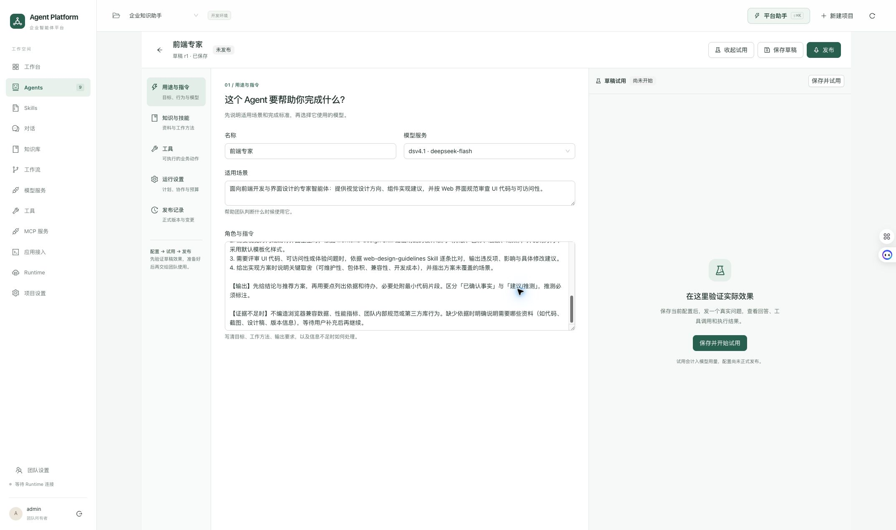
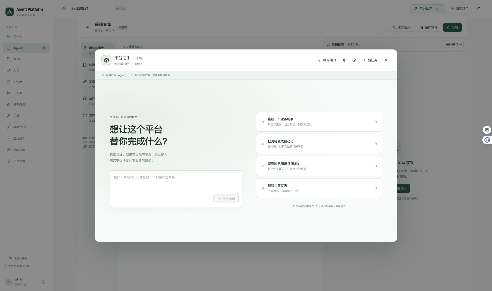
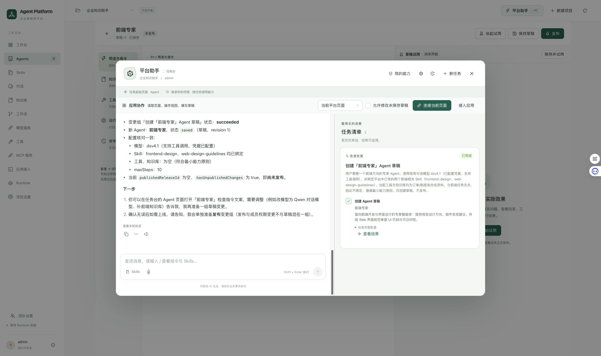

# 平台助手与页面操作体验调研 · 2026-09-14

本轮结论：优先改成「业务页面与助手并排、操作位置有提示、结果能就地核对」的协作体验。先完成空间布局和动作反馈，再扩展暂停接管及第三方 SDK。保留全局唤起入口；默认入口采用侧栏，完整任务台作为用户主动展开的视图。

本文保留实施前的调研快照。后续 P0 实现与实际验收见 [第一阶段交付记录](assistant-page-operation-delivery-2026-09-14.md)。

## 本轮实际查看的流程

环境：已登录的 Edge，当前平台 Agent「前端专家」配置页。三张截图在本轮现场采集，已打开落盘文件核对；未发送模型消息、连接应用或修改业务配置。审查结束已收起助手，恢复业务页面。

| 步骤 | 当前表现 | 评价 |
| --- | --- | --- |
| 1. 查看 Agent 配置页 | 表单、配置导航和草稿试用同时展示，主要字段与操作可见 | 基本清楚；已有试用侧栏，再加入助手时需要统一分配空间 |
| 2. 打开平台助手 | 大型居中弹窗和遮罩覆盖配置页，出现独立欢迎界面 | 严重打断；用户无法同时阅读页面与向助手描述问题 |
| 3. 打开已有助手任务 | 对话和任务清单双栏占据弹窗，实际 Agent 配置仍在遮罩后 | 任务结果可追溯，但对话、清单、实际页面之间缺少直接对应 |

### 1. 业务页面：基本可用，多个侧栏需要协调

表单主体清楚，保存、发布入口可见。右侧已有「草稿试用」，因此把助手再叠成一个抽屉会继续挤占或遮挡页面。后续布局必须同时考虑试用、产物和第三方应用。

### 2. 打开助手：遮挡问题明确

当前进入助手就切换到独立任务场景，欢迎内容占据大量空间。对于「解释这个字段」「帮我填当前表单」这类任务，背景恰好是用户需要继续看的内容。截图支持遮挡结论；遮罩和模态焦点约束也由代码确认。

### 3. 已有任务：清单可用，页面与结果分离

资源变更有完成状态和查看结果入口，应保留。清单固定占据一整列，即使只有一个已完成项目；用户需要关闭助手才能核对实际表单。当前任务的历史消息展示不代表本轮重新执行成功。

## 代码中确认的交互原因

| 原因 | 当前实现 | 影响 |
| --- | --- | --- |
| 主入口采用模态框 | `apps/console/src/features/assistant/PlatformAssistant.tsx:251` 使用居中 Modal；CSS 最大宽 1320px、高 840px | 助手打开时遮挡业务页面 |
| 操作开始会收起助手 | `ApplicationCollaboration.tsx:156` 的 running 回调触发 onReveal；父组件传入 setOpen(false) | 页面突然露出，对话消失，缺少连贯的注意力引导 |
| 页面变化也收起助手 | `PlatformAssistant.tsx:155` 监听 page/resourceId | 连续跨页任务中无法保持稳定的对话位置 |
| 反馈只描述整个动作 | `packages/agent-ui/src/application.ts:19` 的 onStatus 只有 running/title | 无法表达当前字段、子步骤、校验或部分完成 |
| 高亮整个页面或 iframe | `ApplicationCollaboration.tsx:405` 与样式 `.assistant-ui-overlay` | 用户知道有自动化，但不知道具体目标 |
| 结果默认仍偏技术呈现 | `AssistantToolCard.tsx:25` 展示通用完成文案，展开为完整 JSON | 查不到简明的字段变化与结果定位 |
| 多字段操作缺少逐字段反馈 | `platform-application.ts:67` 逐项执行，最后给出填写数量 | 真实执行有步骤，但用户只能看到字段突然变化 |
| 第三方通道缺少进度通知 | `packages/agent-ui/src/bridge.ts:134` 对外提供 observe/invoke/stop | 应用自己的执行阶段不能持续同步到平台侧栏 |

当前也有可复用基础：动作 ID、版本校验、真实回执、停止与取消信号、多字段冲突检测、资源变更审阅，以及现有对话轨迹。上述基础无需重建。

本轮没有重新触发自动操作，不能用静态截图证明动画时长、连续操作流畅度或停止延迟。页面当时显示「等待 Runtime 连接」；本轮也未排查该连接状态。动作时序结论来自当前源码，不是新的运行录像。未对 DSH 或付费参考产品进行新的实机验收。

## 可借鉴的一手资料

| 来源 | 资料明确表达的模式 | 对本平台的建议 |
| --- | --- | --- |
| [Claude in Chrome 官方帮助](https://support.claude.com/en/articles/12012173-get-started-with-claude-in-chrome) | 助手在浏览器侧栏与页面共存，用户可以边看页面边协作 | 让对话在执行期间保持稳定可见 |
| [Microsoft Copilot 设计系统](https://microsoft.design/articles/a-simplified-system/) | 全局入口、聊天侧栏、页面内交互和上下文建议相互配合；当前活动位置有对应信号 | 将任务摘要放在助手内，将正在操作的提示放在目标旁 |
| [Microsoft 365 新版设计说明](https://www.microsoft.com/en-us/microsoft-365/blog/2026/05/28/introducing-a-new-design-for-microsoft-365-copilot/) | 用渐进展开减少初始复杂度；侧栏与文档直接协作，段落、单元格也能原位唤起 | 默认隐藏空任务清单，提供字段和行级入口 |
| [CopilotKit Shared State](https://docs.copilotkit.ai/agent-spec/shared-state) | 进度和中间结果可在应用主界面呈现，用户修改也能反馈给 Agent | 页面、侧栏和轨迹订阅同一执行状态，避免各自猜测进度 |
| [AG-UI Events](https://docs.ag-ui.com/concepts/events) | 提供运行、步骤、工具、状态快照/增量与活动事件 | 借鉴事件语义，给现有协议补充动作进度；整体迁移应独立评估 |
| [Ant Design BorderBeam](https://ant-design.antgroup.com/components/border-beam-cn) | 流光属于装饰性强调，不承担焦点、校验或业务状态语义 | 流光用于辅助突出目标，同时显示动作文字和结果状态 |

右列是结合本项目做出的设计建议，并非声称参考产品具有完全相同的实现。

## 建议的最终交互

### 1. 默认侧栏，为业务页面留出真实空间

- 助手进入页面布局，默认宽度先按 380–440px 验证，可拖动和收起。这是初始设计范围，需在常用屏幕尺寸验收。
- 打开、执行、完成、跨页时保持同一侧栏，不自动弹出或消失，不加全页遮罩。
- 收起后在页面顶栏保留紧凑任务状态、返回对话和停止入口，避免底部浮层挡住表单按钮。
- 任务清单改为助手中的可折叠区域或「对话 / 变更」切换；为空时不独占一列。
- 统一管理助手、草稿试用、产物和第三方页面的空间。宽屏可以展开更多区域；普通屏优先展示当前任务需要的内容，通过标签切换其他面板，保留草稿状态。
- 第三方页面作为工作区主内容，旁边保留助手，减少「模态框 + 另一个抽屉」的组合。iframe 的来源和权限边界保持现有约束。
- 小屏使用明确的页面/助手视图切换与常驻状态条；不能仅按百分比把两个区域挤窄。

### 2. 一次操作，形成完整的可见过程

以「筛选 1 万以下订单，设为高优先级并填写备注」为设计示例，数量由真实返回确定：

| 时刻 | 助手中的信息 | 页面中的表现 |
| --- | --- | --- |
| 开始 | 将筛选金额小于 10,000 的订单，并填写未保存草稿 | 页面保留当前位置，标明当前协作应用 |
| 筛选 | 正在筛选订单 | 筛选区域出现边框与短标签，结果更新后显示真实条数 |
| 选择 | 已找到匹配订单，正在选择目标 | 目标行轻量高亮；不为每次内部查询滚动页面 |
| 修改 | 正在设置高优先级、填写备注 | 对应字段旁标记「助手填写」，完成后可查看原值与新值 |
| 核对 | 正在检查草稿 | 校验通过、失败或结果未知使用不同文案 |
| 完成 | 已填写的字段、实际影响条目和未保存状态 | 保留紧凑结果摘要，支持定位变更；不依赖短暂 toast |

动作提示由实际执行事件驱动。真实操作很快时可合并为一条有内容的结果，不逐字模拟打字，不给每次工具调用增加固定等待。只有明确的计划或批量总量才显示「第几步/共几步」；未知总量不显示虚构百分比。

页面高亮不改变布局尺寸，不移动用户光标，不遮盖目标的输入与点击区域。默认每次仅突出当前关键目标；用户正在滚动或编辑时尊重其位置，并提供「定位当前操作」入口。后台资源查询以侧栏状态表示，不伪装为页面点击。

### 3. 让用户能判断完成程度，也能接手

- 区分「已连接」「正在操作」「等待用户」「正在校验」「已完成」「部分完成/结果未知」，连接成功不等于任务完成。
- 区分停止页面操作和停止整个 Agent 任务；常驻入口应明确实际停止的范围。
- 第一阶段保留现有可靠的停止能力；只有后端具备可恢复的暂停语义后，再提供暂停/继续按钮。
- 用户编辑目标草稿后，停止冲突动作并解释已应用和未应用的部分；恢复前重新观察和校验页面版本。
- 撤销仅在有真实快照和版本条件时提供。用户继续编辑或结果未知时，不能盲目覆盖；服务器持久化写入不能宣传为通用一键撤销。
- 结果卡默认使用业务名称、字段差异和真实保存状态。JSON 与底层工具信息继续保留在详细轨迹中。

## 组件和协议如何落地

项目当前使用 antd 6.6.3 和 assistant-ui。已按 6.6.3 通过 Ant Design CLI 核对 Splitter、Tour 的 API：

| 需求 | 复用方式 | 仍需本项目实现 |
| --- | --- | --- |
| 页面和助手分隔、缩放、收起 | antd Splitter / Splitter.Panel | 全局空间协调、宽度记忆、小屏行为和焦点管理 |
| 局部目标说明 | antd Tour 的目标定位能力可用于验证方案，关闭遮罩；常态执行提示需实测是否适合 | 动作与目标映射、提示避让、非模态交互 |
| 动作强调 | 现有 BorderBeam，限定在目标区域 | 文字状态、减少动态效果时的静态强调 |
| 对话、工具轨迹与资源变更 | 继续复用现有 Chat、assistant-ui 和 ProposalCard | 面向业务的动作摘要、差异与页面定位 |
| 跨应用进度一致 | 参考 AG-UI 事件与 CopilotKit 状态模式 | 现有 SDK/bridge 的进度订阅与回执关联 |

调研时 CLI 提示可更新，依其 skill 升级了本机 @ant-design/cli 至 6.6.4；项目 antd 依赖与 lockfile 未改动。网页获取 Splitter/Tour 时遇到超时，API 依据上述本地官方 CLI 元数据；未据此声称运行验证通过。

建议扩展现有协议，而不是让模型返回任意 DOM 选择器或操作脚本：

1. **动作展示元数据**：业务标题、作用范围、effect，以及由应用注册的稳定 targetId。DOM ref、定位和高亮留在各应用适配层，第三方不必使用同一组件库。
2. **结构化进度**：requestId、递增 sequence、阶段、短摘要、目标、可选的已完成/总数量。只描述任务与执行状态，不要求模型输出内部推理作为进度。
3. **结果差异**：已修改字段、允许展示的前后值、未执行部分、校验结果和保存状态。敏感字段由应用决定隐藏或脱敏。
4. **统一记录**：页面提示、侧栏活动和历史轨迹共享同一 action/requestId；终态以回执为准，过期进度不能覆盖结果。
5. **传输与版本**：第三方 bridge 增加经过校验的进度通知与能力协商；当前 schema 严格校验且固定 1.0，新增协议需要明确版本兼容策略，不能直接塞入未定义字段。
6. **稳定性**：保留短租约、来源校验、动作幂等、页面版本和冲突检测；增加进度时不能让慢动作中断心跳。虚拟列表需先由应用定位并挂载目标，找不到目标时显示可解释状态，不能盲点坐标。

## 实施顺序与验收

| 顺序 | 工作 | 可见收益 | 验收 |
| --- | --- | --- | --- |
| P0-A | Modal 改为布局内助手；任务清单按需展开；统一其他面板 | 助手不再挡住页面，不因动作自动消失 | 常用 1280/1440/1920 宽度下能同时看见操作目标与停止入口；跨页、收起、展开保留会话和草稿 |
| P0-B | 目标映射、局部提示、业务结果卡 | 看得懂正在操作哪里、改了什么 | 覆盖导航、筛选、切换视图、多字段草稿；提示无布局抖动，字段差异与真实回执一致 |
| P1 | SDK 进度协议、第三方适配、暂停/接管语义 | 连续多步任务和第三方页面保持一致体验 | 10–20 步合成流程；含人工编辑、失去焦点、断连、取消、部分完成和结果未知；不重放动作 |
| P2 | 草稿条件撤销、结果定位、按需展开长历史 | 长任务结束后易核对与修正 | 保留用户修改，长列表不强制展开、不反复抢滚动 |

额外体验验收：仅键盘可在页面与助手间移动、停止按钮有明确名称、状态通知采用不过度打断的播报、减少动态效果时仍能辨识目标。当前截图不足以判断完整键盘流程、读屏行为、对比度或响应式表现；这些属于实施后的必测项。

优先交付 P0-A 与 P0-B 的内置页面完整流程，再把同一交互标准扩展到第三方。用户应能立即回答四个问题：助手现在在哪个页面、正在做什么、实际改了什么、如何停下来。
