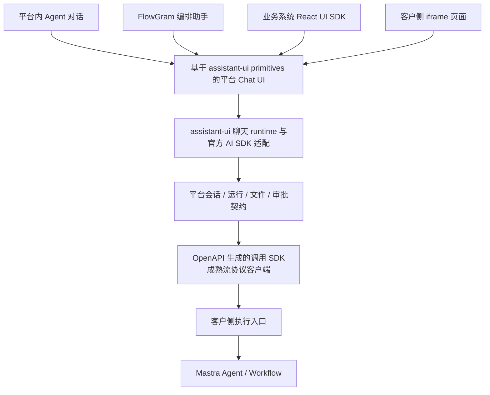

# 企业 Agent 平台 Chat UI 选型调研

日期：2026-09-07。状态：用户已确认 assistant-ui 为 Chat UI 主线；集成验证待完成。已核查官方文档、部分官方源码与 npm 元数据；未安装候选依赖，未进行构建、浏览器、性能或真实 Mastra 集成验证。

## 当前选型

用户已选择 **assistant-ui**。采用其无样式 primitives 和聊天 runtime 构建平台 Chat UI，再复用于平台内聊天、FlowGram 编排助手、React UI SDK 和 iframe。选择依据是界面可定制、对外组件交付和官方 Mastra 集成。正式边界见 [ADR](../adr/0002-assistant-ui-chat-foundation.md)。

CopilotKit 在业务页面状态共享、前端操作和生成式界面成为核心需求时更有价值。AI Elements 提供丰富视觉组件，但当前的 shadcn/Tailwind 体系与项目候选 UI 栈不同，暂不作为首选。

FlowGram 编排、Mastra 执行已经由用户确认，见 [ADR](../adr/0001-flowgram-authoring-mastra-execution.md)。Chat UI 的选择不改变这条执行主线。

## 候选比较

下表的复杂度与适配判断是根据本项目需求作出的推论，不是性能测试结果。

| 候选 | 主要价值 | Mastra 接入 | 本项目需承担的成本 | 建议 |
| --- | --- | --- | --- | --- |
| Ant Design X | antd 体系的消息、输入、附件、引用、会话列表、流式 Markdown 和执行进度组件 | 自定义 Provider，或仅用视觉组件搭配 Mastra 官方 AI SDK UI 路径 | 消息和工具事件映射、审批闭环、持久化；嵌入包的样式与依赖边界 | 保留比较依据 |
| assistant-ui | 聊天状态、工具交互、历史适配和无样式 React primitives | 官方 Mastra 独立服务集成；AI SDK 或 AG-UI | 自管持久化/上传 adapter、平台外观、身份与会话映射 | 用户已选定，优先验证官方 AI SDK 路径 |
| AI Elements | 以源码组件形式交付，工具、确认、附件、引用等视觉能力丰富 | 通过 Mastra AI SDK 适配；组件侧组合 useChat 等状态机制 | shadcn/Tailwind 体系接入、Vite 构建核验、会话与业务逻辑建设 | 接受另一套 UI 体系时考虑 |
| CopilotKit | 应用上下文、前端动作、生成式 UI、页面协作 | 官方 AG-UI/Mastra 集成，可将通信端点放入现有后端 | 通信层接入；OSS 自管会话与增值会话能力的边界 | 深度业务页面协作时考虑 |

来源：[Ant Design X Vite](https://x.ant.design/docs/react/use-with-vite/)、[assistant-ui Mastra 独立服务](https://www.assistant-ui.com/docs/integrations/frameworks/mastra/separate-server)、[assistant-ui AG-UI](https://www.assistant-ui.com/docs/runtimes/ag-ui/overview)、[AI Elements](https://elements.ai-sdk.dev/)、[Mastra CopilotKit](https://mastra.ai/integrations/agentic-ui/copilotkit)。

## Ant Design X 的适配边界

官方 npm 元数据确认 `@ant-design/x`、`x-sdk`、`x-markdown` 当前均为 2.9.0。X 的 peer 范围是 antd `^6.1.1`、React/ReactDOM `>=18.0.0`；官方有 Vite 指南。这证明声明兼容，不能替代安装与构建验收。[X 元数据](https://registry.npmjs.org/@ant-design/x/latest)、[Vite 指南](https://x.ant.design/docs/react/use-with-vite/)。

X 的 Bubble/Sender/Conversations、Attachments、Sources、ThoughtChain 可以覆盖主要展示面；x-markdown 提供流式 Markdown 处理。引用需要后端提供可信文档定位和访问权限，执行进度需要工具与运行事件，审批卡片需要平台的审批提交和恢复接口。[组件及职责细节](chat-ui-ant-design-x-2026-09-07.md)。

`x-sdk` 是可选的浏览器状态和请求机制，不是对外业务 API SDK。本次未确认内置 Mastra Provider，也未验证 Hey API 的流接口与 XRequest 能否直接组合。可在原型中比较自定义 X Provider 与只使用 X 视觉组件两条路径，但同一会话必须有一个明确的状态所有者。[自定义 Provider](https://x.ant.design/x-sdks/chat-provider-custom/)。

如果对外 React 包将 antd 设为 peer，需要声明兼容范围；如果自带 antd，则需控制体积与样式边界。iframe 可提供独立依赖环境，具体宿主支持矩阵由产品需求决定。

## assistant-ui 的适配边界

assistant-ui 官方提供前后端分离的 Mastra 接法，通过 `@mastra/ai-sdk` 输出兼容流，客户端聊天 runtime 消费。这里的 runtime 是浏览器聊天状态管理，不是客户侧 Mastra 执行服务；基本集成不要求 Assistant Cloud。[独立服务集成](https://www.assistant-ui.com/docs/integrations/frameworks/mastra/separate-server)。

它支持自定义历史与附件适配，也支持 AG-UI；可以连接平台自己的存储与服务。官方区分无样式 **Primitives** 与带样式 **Elements**：本项目从 primitives 构建平台外观，无需先采用默认模板再迁移样式。布局、主题和业务卡片仍需实现。[Primitives](https://www.assistant-ui.com/docs/primitives)、[专项核查](chat-ui-assistant-copilot-2026-09-07.md)。

版本迁移需注意：当前主文档采用 AI SDK v7 与 `@assistant-ui/ai-sdk`，旧的 v6 文档采用不同包。npm 元数据中 `@assistant-ui/ai-sdk@0.0.4` 依赖 `ai ^7.0.85` 与 `@ai-sdk/react ^4.0.88`；不能混用不同代示例。依赖中包含 assistant-cloud 客户端包本身，不代表必须采用其托管服务。[当前适配说明](https://www.assistant-ui.com/docs/runtimes/ai-sdk/v7)、[npm 元数据](https://registry.npmjs.org/@assistant-ui/ai-sdk/latest)。

## AI Elements 与 CopilotKit 的边界

AI Elements 的组件以源码加入项目，基于 shadcn/ui，包含消息、输入、附件、工具、确认、来源等组件。当前起步指南围绕 React 19、Next.js、Tailwind 4 和 AI SDK；Vite 选用具体 React 组件的可行性应通过构建验证，不能从指南推导所有组件都必须依赖 Next.js。[组件入口](https://elements.ai-sdk.dev/)、[起步要求](https://elements.ai-sdk.dev/docs/setup)。

其 Inline Citation 是引用展示组件，与流式 Markdown 的自动集成仍需自定义处理。对于知识库，文档页码、片段、文件权限应来自检索结果，不能由生成的链接替代可信来源。官方推荐的 AI Gateway 是可选服务，Mastra 自有模型接入可继续使用。[引用边界](https://elements.ai-sdk.dev/components/inline-citation)、[Mastra AI SDK UI](https://mastra.ai/integrations/agentic-ui/ai-sdk-ui)。

CopilotKit 基本功能可自行部署，通信端点可挂入已有服务；它更值得用于“理解当前业务页面并操作它”的需求。官方完整 Rich Threads、事件回放和同步属于 Intelligence；OSS 可自行管理 threadId、存储、会话列表和恢复，但不存在可替换 Rich Threads 后端的标准接口。Intelligence 自托管的许可和运行依赖需另行评估。[自管会话](https://docs.copilotkit.ai/mastra/threads-self-managed)、[自托管](https://docs.copilotkit.ai/mastra/intelligence/self-hosting)。

本次核查的 Ant Design X、assistant-ui 与 CopilotKit React 包许可字段为 MIT；AI Elements 官方 LICENSE 为 Apache-2.0。候选核心包的许可与可选云/增值服务条款是不同事项，具体版本交付范围仍须保持清晰。[元数据快照](chat-ui-package-metadata-2026-09-07.json)、[AI Elements LICENSE](https://raw.githubusercontent.com/vercel/ai-elements/main/LICENSE)。

## 建议的组件与协议分层

此图记录选型后的集成方向，运行效果待验证。assistant-ui 官方 runtime 集成路径统一管理聊天状态，平台在其上实现自身业务适配。采用现有协议客户端处理流传输。

按用户要求，平台 HTTP 请求方法和数据类型由 OpenAPI 生成。Chat UI 的展示映射、会话交互和流事件聚合不是请求 SDK 生成器的职责。流式接口需要在契约中说明事件结构，并验证生成客户端或既有协议客户端能完整处理它；本次没有完成这项运行验收。

平台消息需要表达文本、附件、知识引用、工具状态、人工交互、工作流进度和产物。可以在选定协议上承载这些类型；UI 历史恢复必须保留结构化内容，不能只保存最终文本。Mastra 已提供 AI SDK UI 适配，并明确允许独立服务连接 Vite + React。[Mastra AI SDK UI](https://mastra.ai/integrations/agentic-ui/ai-sdk-ui)。

## 同一套 Chat UI 的三个产品入口

1. **Agent 对话**：使用已发布 Agent，显示答案、引用、附件、工具与运行状态。
2. **FlowGram 编排助手**：携带草稿标识和版本，AI 产出可校验的流程修改；呈现差异并通过平台编辑命令应用。与直接执行业务工具区分动作类型。
3. **业务系统嵌入**：同一组件通过 React 包和 iframe 页面交付。业务应用仅引入聊天时，不加载 FlowGram 编辑器。

对外 UI 包应暴露平台级配置，例如应用/Agent 标识、会话、认证回调、主题、语言、工具卡片渲染和事件回调；尽量不把某个候选库的内部 runtime 对象作为公共契约。

iframe 提供界面及依赖隔离，客户网络可达性、短时会话凭据、用户委托、允许的宿主 origin、尺寸通信和文件下载路径仍需设计。客户数据是否允许经过集中控制面尚未得到回答，因此本调研不假定所有嵌入请求都由集中控制面代理。

## 原型验收建议

以 assistant-ui primitives 和官方 Mastra 独立服务集成为基础完成以下验证；其中前端保持 Vite，历史、上传及身份连接平台服务。

| 用例 | 验收重点 |
| --- | --- |
| 流式文本与 Markdown | 中文输入法、代码块未闭合、表格、用户主动向上滚动后不抢回底部 |
| 并行工具 | 两个工具增量交错、独立结果、单个失败、可见状态和稳定 toolCallId |
| 人工交互 | 批准/拒绝、重复提交、刷新后恢复待处理状态，并由服务端决定可执行动作 |
| 知识库 | 附件上传、入库进度、可信引用及页码定位，下载鉴权 |
| 会话与运行 | 切换、分页历史、刷新、断线续传、取消与服务端实际状态一致 |
| 编排助手 | AI 修改草稿后画布同步，可撤销，过期草稿不会覆盖人工修改 |
| 两种嵌入 | React 宿主与 iframe，主题、身份、跨域、尺寸、窄屏和键盘导航 |
| 包交付 | React peer、antd 是否外置、CSS/浮层作用域、长消息表现和实际构建体积 |

这些用例是下一阶段的验证计划，本次调研没有把它们标记为通过。

## 证据文件

- [Ant Design X 专项](chat-ui-ant-design-x-2026-09-07.md)
- [assistant-ui / CopilotKit 专项](chat-ui-assistant-copilot-2026-09-07.md)
- [npm 元数据快照](chat-ui-package-metadata-2026-09-07.json)
