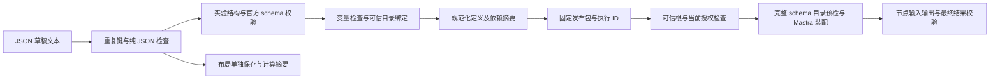

# 发布清单、依赖固定与严格编排校验实验

日期：2026-09-07。对应[发布契约事实研究](../../.scratch/agent-platform/issues/25-release-contract-facts.md)。范围为候选契约的确定性实验，不替代首期节点范围选择、FlowGram 画布、AI 生成质量或完整发布协议。

## 得到的具体结果

一份合成订单工作流，经过严格 JSON 解析、官方 schema 校验、平台变量与依赖检查、规范化和摘要计算后，可以装配为两个固定 ID 的 Mastra 工作流并执行。工具依赖按固定目录绑定实际注册键；根运行同时受发布完整性与当前资源授权检查。

42 项断言通过。移动布局不改变执行摘要；改变子流程会同时改变子流程和父发布摘要；切换工具 v1/v2 分别得到合成总额 120/240，之后重新使用 v1 仍得到 120。被篡改的发布、重新计算摘要但不匹配可信根的包、错误依赖、已撤销工具，以及越过输入/输出约束的调用被拒绝。

这些是实际代码观察；“服务端可信根”“当前授权目录”和“已装载源码”在本轮由本地测试驱动提供，不代表正式发布、身份、签名或制品装载服务已经存在。

## 固定环境与材料

| 项目 | 实际值 |
| --- | --- |
| 执行 SDK | `@mastra/core 1.64.0`、`zod 4.5.4` |
| 校验与规范化 | `ajv 8.20.0`、`canonicalize 4.0.0`、`jsonc-parser 3.3.1` |
| 环境 | macOS arm64、Node 24.13.0、pnpm 10.32.1 |
| 样例 | 授权目录查询工具 → 固定报告子工作流 → mapping 汇总；全部合成数据 |
| 合同范围 | 线性 Tool/mapping、同包子流程、内联 schema 子集和独立布局位置 |
| 证据 | 完整观察、版本、发布包、示例草稿及七个输入文件的 SHA-256 |

[实验目录与复跑说明](../../.scratch/agent-platform/research/release-contract/README.md)提供 `pnpm verify`；[机器可读草稿结构](../../.scratch/agent-platform/research/release-contract/draft.schema.json)、[示例草稿](../../.scratch/agent-platform/research/release-contract/evidence/example-draft.json)和[完整结果](../../.scratch/agent-platform/research/release-contract/evidence/latest.json)可直接核对。目录中的 schema 是实验输入格式，不能当作正式平台 OpenAPI 或 SDK。

已归档到独立分支 `research/release-contract`，提交 `175c07c928230b83c929565d182b7f174d0f0b38`。提交后工作区干净，冻结锁文件安装通过；42 项证据对应的源码摘要一致，文档链接和决策依赖检查通过。

## 处理链路

发布摘要包含规范化定义、子发布/工具依赖、作用域、Mastra 版本、编译器源码摘要、实验 schema 摘要和锁文件摘要。执行 ID 从该发布摘要派生；布局单独计算摘要，不能携带隐藏执行节点。根摘要是待验证制品内容的身份，不承担客户授权凭据的作用。

## 42 项检查覆盖面

| 类别 | 通过的关键观察 |
| --- | --- |
| 真正执行 | 两个固定执行 ID 的父子工作流装配成功；变量按调用点返回，合成结果符合输出 schema |
| 规范化 | JSON 对象键序、bundle 声明顺序、mapping 对象/字符串空白归一；数组顺序与 Unicode 原值仍影响摘要 |
| 版本隔离 | 布局变化不影响执行版本；子流程修改沿依赖关系改变父摘要；工具 v1/v2 可各自执行 |
| 原始 JSON | 解码后重复键、注释、尾逗号、无穷数、不安全整数、孤立 surrogate、保留属性名及超尺寸输入被拒绝 |
| 目录与权限 | 候选不能伪造租户字段；不存在的工具、原型属性名、目录键/资源身份不匹配、跨租户目录项和浮动版本被拒绝 |
| 图与变量 | 重复节点、前向/不存在引用、可选字段无默认值、伪算术模板、多来源 mapping、错误输出结构、循环依赖、未支持节点和外部 schema 引用被拒绝 |
| 执行边界 | 负的 minAmount 和额外字段在工具调用前拒绝；工具返回违反约束的原始结果后，运行失败而不产出成功报告 |
| 发布验证 | 改内容保留旧摘要、攻击者自算新摘要、同引用换实现、装载源码不匹配、缺失固定子发布及运行授权撤销被拒绝 |

所有检查名称及结果逐项保存在 JSON 中；上表归类，不把同一行当作一个独立通过用例。实验对 schema 的静态检查仅证明支持范围内的类型/必需路径，数值等约束继续在真实执行边界验证，不声称完成一般 JSON Schema 包含关系证明。

## 这次实际纠正的接入假设

### normalize 与 schema 验证是两步

首轮反例发现单独调用 `normalizeWorkflowBuilderDefinition` 会接受同时含 `value` 和 `initData/path` 的 mapping 描述。若平台随后自行按某个字段优先解释，就可能静默选中一条来源。

改进后的实验先严格解析字符串形式的 mapConfig，再将对象与字符串统一为对象，显式调用官方 `workflowBuilderDefinitionInputSchema.safeParse`，之后才 normalize。两种形式的混合来源都已加入拒绝断言。仅对外层输入 schema 做校验而不解码 mapConfig 字符串，仍不能覆盖内部描述。[官方源码与对象/字符串对照](release-canonicalization-source-2026-09-07.md)

### 外层 JSON 规范化看不到字符串内部

Mastra 的对象 mapConfig 规范化采用 JSON.stringify；已有字符串保留其字节。外围使用 JCS 不会自动消除字符串内的键序/空白差异。实验对内部映射对象独立严格解析与规范化后再编码，验证了对象形式和不同排版字符串得到相同执行摘要。

JSON.parse 之后无法还原被覆盖的重复键，所以入口先用 parseTree 保留属性节点、逐对象检查解码后的键，再执行 JSON.parse；JCS 检查 Unicode/有限数。实验另拒绝不安全整数和保留属性名，这是候选平台输入限制，不能称为 JSON 标准要求。[RFC 与固定库边界](release-canonicalization-source-2026-09-07.md)

### preflight 使用 schema 目录，装配使用真实注册键

预检上下文需要 `inputSchema/outputSchema` 的 JSON Schema 记录，不能直接把 Tool/Workflow 实例当作该记录传入。实验修正了这一接入错误，并显式提供 agents/tools/workflows 三类索引，避免缺省目录跳过引用检查。

工具目录中可见的工具内在 ID 与注册 key 也需区分。固定源码显示某些预检索引可以识别内在 ID，但实际 getTool 装配使用注册 key；本实验为每个固定依赖构造相同的内在 ID 和实际注册 key，从源头避免歧义。[固定源码依据](release-canonicalization-source-2026-09-07.md)

## 对平台方案的影响

发布清单可以沿用“定义与布局分离、依赖逐层固定、恢复按可信发布引用装配”的方向。AI 生成工具提交的候选仍必须进入与人工编辑相同的校验链路；候选自行填写的校验结果、摘要、资源权限都不能替代服务端决定。

只改变布局不需要生成新的执行制品；执行定义、依赖实现或编译器兼容条件改变会形成新版本。该规则是保守的内容身份比较，不保证所有业务含义相同的不同表达都会合并，也不保证模型输出可重复。

应继续采用独立运行边界校验。Mastra 动态 JSON Schema 转换未落实所有已观察的约束，不能以“生成了 schema”替代执行时检查。当前授权也不能被冻结为发布时一次批准；本轮只在合成工具目录上验证撤销，完整内容许可、模型、Agent 内部调用与离线租约仍待集成。

## 未覆盖与使用限制

- 没有真实 AI 生成、FlowGram 编辑/保存往返、Agent 节点、条件/并行/foreach、跨包依赖、任意 schema 或完整变量语言；不能据此关闭完整编排原型。
- 没有正式身份校验、发布签发与激活事务、分布式依赖准备、旧版本清理、持久化恢复、可信制品加载/隔离；相关产品草案保持原状态。
- 输入是已解码的 JSON 文本。真实 HTTP 字节解码必须单独拒绝无效编码；实验尺寸/数量上限及属性名限制不是正式产品参数。
- 工具源码由可信测试驱动读取并传入摘要，运行函数为同一固定实验模块。尚未验证恶意装载器、文件变更竞争或真实供应链；根摘要相等不等于已经建立签名与发布者信任。
- Runtime 在每次工具调用前重查合成授权，但没有测试调用期间撤销、已发出写入、取消和网络分区。

本研究为[发布与版本方案](../planning/publication-and-version-pinning-proposal.md)和[AI 编排契约](../planning/ai-workflow-authoring-proposal.md)补充实际证据，未决定待回答的离线和跨主机范围。
